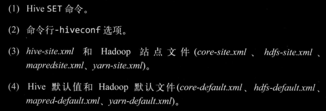
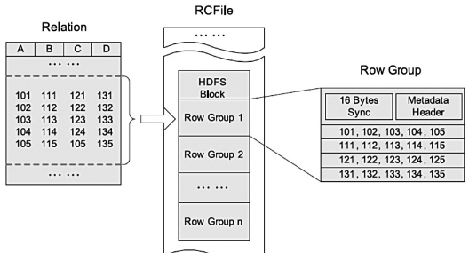
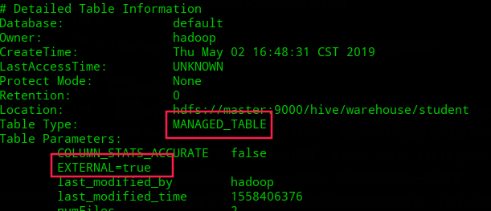
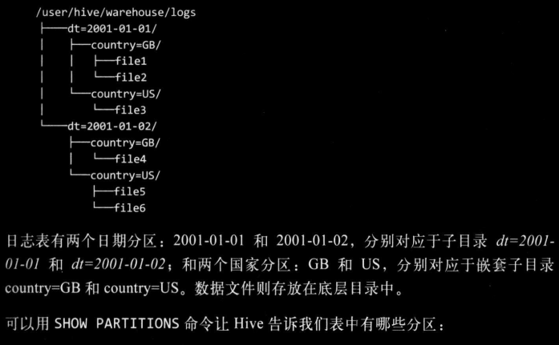
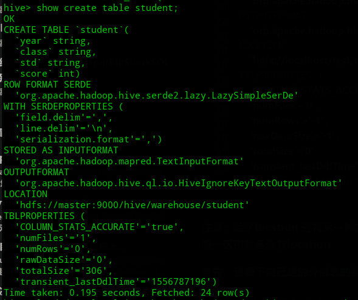

### 参考

- [<https://hive.apache.org/>](https://hive.apache.org/)

- 《Hadoop权威指南》第四版

主要从hql（DDL、DML），Hive函数（UDF）、Hive调优几方面下手

- [Hive DDL数据定义](https://cwiki.apache.org/confluence/display/Hive/LanguageManual+DDL)

- [HIve DML数据操纵](https://cwiki.apache.org/confluence/display/Hive/LanguageManual+DML)
- [Hive UDF用户自定义函数](https://cwiki.apache.org/confluence/display/Hive/LanguageManual+UDF)

### hive shell操作

这里不说通过hive进入cli，而是非交互模式下运行hive的shell环境
命令行下，`hive -f test.q`可以执行test.q脚本中的HiveQL语句，`hive -e ‘show tables’`可以执行较短脚本

> 交互和非交互都会打印运行时的信息，不过可以通过`-S`强制不输出

hive shell交互环境内也可以通过语句前加上`!`来运行本地操作系统的命令，一般用来查看本地文件，省的退出cli，其次可以用如`dfs  -ls /`执行hdfs相关操作


Hive相关属性配置设置及查看问题，像Hive的配置默认是conf目录下有hive-site.xml，hive-default.xml（也可以在hive启动时通过`hive --config xxx/hive-conf`指定在其他位置hive-conf下查找hive-site.xml)，也可以在`hive -hiveconf xxx=xxx`启动单一会话时指定配置，或者在hive会话中通过set命令来指定或查看相关配置。这些配置还有优先级关系，如图，优先级递减




### Hive相关配置

hive-site.xml

- `hive.metastore.warehouse.dir`：仓库目录

- `hive.cli.print.header`：是否打印表的头部（就是cli下查询时要不要一起打印），打印为true
- `hive.cli.print.current.db`：是否打印当前数据库名，打印为true

hive-log4j.properties

- `hive.log.dir`：运行日志输出位置

### Hive架构

- 用户接口层：像cli命令行shell环境、Thrift Server让用户可以使用多种不同语言来操作Hive，像JDBC/ODBC、HWI图形化界面
- MetaStore：元数据存储服务，Hive和MySQL(或Derby)之间通过MetaStore服务交互
- Driver：包含解释器、编译器、优化器、执行器
    - 解释器负责词法、语法、语义的分析和中间代码的生成，将hql语句转成抽象语法树
    - 编译器是把语法树编译成逻辑执行计划
    - 逻辑层优化器对逻辑执行计划进行优化，多是减少MR的作业数量、shuffle数据量
    - 物理层优化器进行MR任务的变换，最终生成相应的物理执行计划
    - 执行器调用底层执行引擎执行相应物理执行计划

### 执行引擎

Hive作业的执行引擎，默认是MapReduce，也支持Spark等，可以通过hive.execution.engine来指定，如`hive> set hive.execution.engine=spark;`

像spark这种，其比MR更加灵活，性能更好。一是因为DAG的引入，job间依赖关系；二是因为spark不会像MR一样把job的中间输出结果存储在hdfs上，而是依据hive规划器的请求将中间输出写到本地磁盘，或者内存中

### 元数据存储Metastore

metastore这是一个单独运行的进程，可以远程，默认是和Hive运行在同一个JVM中，负责服务和后台的数据存储。像表的结构、相关信息就是由metastore服务存储在关系型数据库，表中实际数据存储在hdfs上。

一般是配置一个隔离的MySQL作为metastore，hive也默认提供了一个以本地磁盘为存储的Derby数据库作为metastore（这种方式每次只有一个Derby可以访问磁盘上的数据库文件，所以只支持一个Hive会话）      

### 建表引出的DDL

**提前说一下，DDL操作的是表结构，实际上就是对MySQL中存储的meta_data元数据信息进行操作**

```sql

CREATE [TEMPORARY] [EXTERNAL] TABLE [IF NOT EXISTS] [db_name.]table_name
  LIKE existing_table_or_view_name
  [LOCATION hdfs_path];

```


基本语法：
```sql
create [TEMPORARY] [EXTERNAL] table [if not exists] [db_name.]table_name(
    col col_type,
    ...
)
row format delimited	//定义加载数据的格式化
fields terminated by 'char'	//字段用char分隔
collection items terminated by 'char'	//array集合中数据用char分隔
map keys terminated by 'char'	//map中k-v用char分隔
lines terminated by 'char'	//行用char分隔
NULL defined as 'char'	//空缺值用char代替

partitioned by (col_name data_type) //分区
clustered by (col_name1, col_nam2e, ...) [sorted by(col_name [ASC|DESC], ...)] into nums buckets	//分成nums个桶，sorted by是按指定的字段生产排序桶

stored as file_format	//表存储为什么格式
location hdfs_path      //指定仓库位置，一般是用在外部表中
[TBLPROPERTIES (property_name=property_value, ...)]
;
```
不支持主键`primary key`和外键`foreign key`

`col_type`，这里的字段类型除了sql中那些基本类型，像int、string，还有定义array_type(包含同一类型的数组)、map_type(存K-V类型数据)、struct_type(像结构体一样可以存不同类型数据)、union_type(是从指定的几种type中符合其中一种类型即可)。用法：

```
create table p(
    col1 array<string>,
    col2 map<string,int>,
    col3 struct<a:int,b:string,c:double>,
    col4 uniontype<sting,int,float>,
    ...
)
...
```

`file_format`：文件格式，默认是textfile，就是文本格式在配置`hive.default.fileformat`中指定的。还有SEQUENCEFILE(二进制格式存储在hdfs上)、RCFILE、ORC、PARQUET、AVRO、JSONFILE

>- textfile：按行存储，数据不压缩磁盘开销大
>
>  - 其实就是Hadoop中几种输入输出格式
>
>    InputFormat:            `org.apache.hadoop.mapred.TextInputFormat`         
>
>    OutputFormat:           `org.apache.hadoop.hive.ql.io.HiveIgnoreKeyTextOutputFormat` 
>
>- sequencefile：二进制文件，也是按行存储，不过会使用Hadoop的writable接口对k-v数据序列化和反序列化
>
>  - 使用的SequenceFile继承自Hadoop的SequenceFile API，不过Key为空Value存储实际值（MapReduce的map阶段省去了排序）
>  - SequenceFile会比textfile大，多了一些像文件标识、数据格式、校验信息、文件元数据等。可以通过hdfs命令`hdfs dfs -du -h -s xxxx`查看目录下文件大小
>  - SequenceFile不能直接使用load将数据加载到存储格式为SequenceFile的表中，要先创建TextFile的存储格式的表中，然后insert into到存储格式为SequenceFile的表中
>
>- rcfile：Hive中一种专门面向列的数据格式，遵循“**先按列划分，再垂直划分**”的设计理念，我的理解是按列划分，以行存储。当查询Hive不需要查询的列时，它会在IO上跳过这些列。需要说明的是，RCFile在map阶段**从远端拷贝的仍然是整个数据块**，并且拷贝到本地目录后，**RCFile会通过扫描每一个row group的头部定义来判断读取哪些列**，但是在整个HDFS Block 级别的头部并没有定义每个列从哪个row group起始到哪个row group结束。所以在读取所有列的情况下，RCFile的性能反而没有SequenceFile高。
>
>  
>
>  > 参考：<https://my.oschina.net/repine/blog/633160>
>  >
>  > 像RCFILE满足数据仓库的四大关键需求：数据快速加载、快速查询处理、高效存储空间利用率、对高度动态的工作负载模式的强适应性
>  >
>  > **RCFile优点：**具备相当于行存储的数据加载速度和负载适应能力，使用列维度的压缩能够有效提升存储空间利用率，读优化可以避免扫描表格时读取不需要的列
>
>- orc：也是一种列式存储格式，用于降低 Hadoop 数据存储空间和加速 Hive 查询速度。类似parquet但是首先根据行分割整个表，然后在每一个行组内按列存储
>
>  - orc可以大程度节省存储和计算资源，但会在读写时消耗少部分额外CPU资源来压缩和解压缩
>  - orc文件还可以为每一个字段建立轻量级索引 [可参考：HIve优化 orc索引](http://lxw1234.com/archives/2016/04/630.htm)
>  - 总的来说，压缩率最高，性能也高
>
>- avro：用于支持数据密集型的二进制文件格式。它的**文件格式更为紧凑**，**适合读取大量数据**时，Avro能够提供更好的序列化和反序列化性能
>
>- parquet：我最先是在spark学习时接触了这种存储格式

- 内部表和外部表
  - 内部表(Managed table)和外部表（External table），默认是把数据存储在仓库目录中（`hive.metastore.warehouse.dir`），但也可以在建表时通过location指定仓库目录以外的位置存储数据
    - 建好表后也可以更改location位置，`alter table table_name set location 'xxx'`
  - 内部表的数据和元数据都由hive管理，所以删除时会一起删了
  - 外部表在定义时不会检测location指定的位置是否存在，只有元数据由Hive管理，所以删除表时也只是删除表结构不会删除实际数据
  - 外部表在建表时要带上External

> 更改内(外)部表为外(内)部表：`alter table table_name set tblproperties('EXTERNAL'='TRUE')`，FALSE的话就是更改为内部表 【**可以小写true，但EXTERNAL要大写，经测试**】


load是移动数据的操作，只是文件的移动或重命名，速度快，insert是插入由MR作业完成。还有就是Hive在数据加载时不会检查文件中数据格式是否符合表中申明的模式，只有查询时会检查，不匹配的话会返回空 Null

- 加载数据
    - insert，会起MapReduce不推荐
      - 最简单的就是`insert into table_name values('xxx','xxxx')`
      - 根据其他表的查询插入数据
      > 
      ```sql
      insert into table_name [PARTITION (partcol1=val1, partcol2=val2 ...)]
      select col1,col2
      from table2;
      # 根据多张表的查询结果，多插入模式
      # select_statement是相应的select语句
      from table2
      insert  into table table_name1 [PARTITION (partcol1=val1, partcol2=val2 ...)] select_statement1
     [insert into table tablename2 [PARTITION ...] select_statement2]
     [insert overwrite table tablename3 [PARTITION ... [IF NOT EXISTS]] select_statement3] 
     ...;
      ```
      - 创建表时通过 select 加载数据，`create table [if not exists] table_name as select col1,col2 from otherTable;` 
  - load：`load data [local] inpath 'xxx' [overwrite] into table table_name;`
      - 不加local，则inpath是hdfs上的目录下的文件（move操作），加了是本地目录下的文件（copy操作）
      - 加overwrite是覆盖元数据，不加会另外再copy一份数据而不覆盖
      - 有分区分桶时，load数据必须指明分区分桶，如`load data inpath 'xxx' into table table_name partition(col='yyy');`
  - 还有就是直接put上传数据到对应文件夹下，然后查询（原理和load一样）。不过如果是分区表，因为缺少相应分区的元数据信息，所以上传数据后要添加相应的分区或者直接修复表的元数据信息`msck repair table table_name`
  - import导入数据，`import [external] table table_name from 'source_path';`  [参考这篇博客](https://www.cnblogs.com/wcwen1990/p/6845850.html)
    - **首先要确保使用export导出**hive管理的数据到source_path下
    - `export table table_name [PARTITION (part_column="value"[, ...])] TO 'export_path' [ FOR replication('eventid') ]`，导出包含数据文件和meta_data元数据文件
    - import/export一般用在数据仓库之间数据的复制，很少使用
    ```sql
    # 导出分区
    export table employee partition (emp_country="in", emp_state="ka") to 'hdfs_exports_location/employee';
    # 导入指定分区
    import table employee partition (emp_country="us", emp_state="tn") from 'hdfs_exports_location/employee';
    ```
> 数据的加载是DML，这里提前说了下

- 分区和分桶

  - 对于文件系统而言，分区只是在表目录下生成了嵌套子目录，其意义在于将查询限定在一定范围内可以加快处理速度

    > 
    >
    > 图片出自《Hadoop权威指南》第四版
    >
    > `show partitions table_name;` 可查看所有分区

  - 分区在建表时通过`Partitioned by(col col_type)`指定，**分区中指定的字段不能和表中定义的字段同名**。在插入数据时通过`Partition(col='xxx')`指定分区名

    > 不能同名，比如上图
    >
    > `select *  from logs where country='US';`这个查询会限定在分区country是us的文件中查询，也就是file356，但如果表中也有一个字段叫country的话语义就有问题，故不可同名

  - 分区中定义的列（字段）是表中正式定义的列，叫做**分区列**，但只作为目录名不是存于数据文件中

  - 桶是将表或分区加上额外结构组织起来的（具体说就是把表和分区的进一步划分，将数据按照分桶字段的hash值散列成多个文件），为的是**获得更高的查询效率**。像map Join就可以连接两个在相同列上划分了桶的表（两张表的桶数成整数倍或因子）。其次，**分桶便于抽样**，可以抽取部分数据试运行

  - 分桶在建表时指定要分桶的列和桶的个数，`clustered by(age) into 3 buckets`，Hive在存数据时也是根据对值的hash并对桶数取余插入对应桶中的

    > 还能划分成排序桶，及根据一或多个列排序，可以进一步提供mapJoin的效率
    >
    > `clustered by(age) sorted by(age asc) into 3 buckets` 

  - 设置了分桶的表要插入数据需要设置属性`hive.enforce.bucketing=true`，因为分桶默认是不开启的

  - 分桶表不能直接通过load加载数据（因为load只是copy一份文件到指定目录下 ，而分桶会根据字段有多个文件产生），而是要创建一张中间表tmp_table，将数据load加载到中间表，然后通过`insert into bucket_table select * from tmp_table;`

  - 分桶抽样tablesample语句，`select * from bucket_table tablesample(bucket x out of y [on col])`

    - y是桶数的倍数或因子，比如y=2,4个桶，所以抽4/2=2个桶的数据，然后从第x个桶开始，下一个要抽样桶是x+y。如果y=8,4个桶就是抽半个桶数据。**要注意：x的值必须小于等于y的值**
    - 分桶表后面可以不带on 字段名，不带时默认的是按分桶字段,也可以带，而没有分桶的表则必须带
    - 按分桶字段取样时，因为分桶表是直接去对应的桶中拿数据，在表比较大时会提高取样效率

这里说下，分区最终可以看到对应分区名的目录，分桶而是文件

删除分区，`alter table table_ptn drop partition (col='xxx');`
  - 删除多个分区，`alter table table_ptn drop partition(col='xxx'),partition(col='yyy')`，逗号隔开

添加分区，`alter table table_ptn add partition (col='xxx') location 'xxxx/xxxx';`，location是可选项
  - 添加多个分区，`alter table table_ptn add partition(col='xxx') partition(col='yyy')`，空格隔开

修改分区，`alter table table_ptn partition (col='xxx') set location 'xxxx/xxxx';`（分区指向新的位置）

利用分区查询，`select * from table_ptn where col_par='xxx';`，col_par是分区字段，如果要查询多个分区用or连接（也可以用union，但会走MapReduce，不推荐）


- 其余常用DDL
    - 另外创建表的方式：`create table t2 like t1;`（只复制t1表结构）和`create table t3 as select col1,col2 from t1;`（复制t1表结构和数据col1、col2，会起MR任务不推荐）
    - 修改表名，`alter table old_name rename to new_name;`
    - 增加字段，`alter table table_name add columns (col col_type);`//和表中定义字段一样
    - 修改字段，`alter table table_name change column col new_colName new_type;`
    - 替换字段，`alter table table_name replace columns (col1 col1_type,col2 col2_type);`，这个是将原有的表元数据信息替换成新的元数据信息（就是新表只有col1、col2字段）
    - 删除字段，没有直接drop的方法，而是通过replace保留表的某些字段来达到删除字段的效果，`alter table table_name replace columns (col1 col_type,col2 col_type);`（假设原有col1、col2、col3）
    - 删除表和清空表，和SQL一样`drop table table_name;`和`truncate table table_name;`
      - **清空表的数据只对Managed table内部表有效**，非内部表（non-managed table）会抛出异常
    - `describe formatted table_name;`，查看表结构详细信息
    - `show create table table_name;`，查看建表语句，它还会显示用到的类，如图
          
    - `show databases;`
    - `show tables`，`show tables in dbname`，查看database中有哪些表，`show tables like ‘abc*’`(like后面是tablename的正则式)
    - `show partitions table_name`，查看表的分区有哪些
> 其实，表创建好后不会用到对表的修改，毕竟可能会被其他事务引用到，一修改问题就大了。所以通常要修改时都采取重创建的方法
  
### 查询相关连的DML
看官方文档可以发现，他们吧查询从DML中专门给拎出来了，但像关系型数据库Mysql这些是把select算入DML的，所以我这里也归在一起

#### select基本语法结构
文档在此：<https://cwiki.apache.org/confluence/display/Hive/LanguageManual+Select>

```sql
[WITH CommonTableExpression (, CommonTableExpression)*]    (Note: Only available starting with Hive 0.13.0)
SELECT [ALL | DISTINCT] select_expr, select_expr, ...
  FROM table_reference
  [WHERE where_condition]
  [GROUP BY col_list]
  [ORDER BY col_list]
  [CLUSTER BY col_list
    | [DISTRIBUTE BY col_list] [SORT BY col_list]
  ]
 [LIMIT [offset,] rows]
```
- select_expr是查询表达式，就是字段、表达式这些
- 基本和SQL标准语法一样，除了`cluster by/distribute by/sort by`，还有一个`partition by`
- `limit rows`同mysql中一样，限制select返回的行数。像`limit 3`是返回前三行，`limit 2,4`是第三行到第六行的查询记录
- 还有一个不同于标准SQL的用法就是分区表可以在where或者join on的条件处使用分区字段进行查询
> 文档上提出了一个分区修剪（partition pruning）的概念，相关查询可以执行分区修剪，并且是只扫描与查询指定的分区相关的表的一小部分。
> 这也是分区表设计的目的，避免了全表扫描的开销。具体怎么个用法，就像用表的字段过滤一样，都支持`and、or`、`=、>、<、<>、>=、<=`、`like`，比如说分区字段date、country
> ```sql
> select * from a join b 
> on (a.id=b.id and a.date>='2019-05-29' and a.country like 'china');
> ```

#### 聊聊聚合 group by

#### Order, Sort, Distribute 和 Cluster By

|               |         功能         |                                                   特点                                                   |
| :-----------: | -------------------- | -------------------------------------------------------------------------------------------------------- |
|   order by    | 全局排序              | 一个Reduce、默认升序Asc                                                                                    |
|    sort by    | 局部排序              | Reduce内部排序，要设置好Reduce个数(`mapreduce.job.reducers`)                                                 |
| distribute by | 按字段分区(partition) | 多和sort by合用，起到分区排序，且必须写在sort by前。根据reduce个数产生多个文件，不修改reduce个数默认一个分区？？？ |
|   cluster by  | 分区+排序             | distribute by和sort by的字段相同时，**只有倒序排序**                                                        |

reduce的个数默认是-1，会根据Hql语句进行优化调整，可通过`set mapreduce.job.reduces;`（`mapred.reduce.task`也可用来设置reduce个数）查看

- distribute by应用场景

> 小文件合并：设置一个reduce任务`set mapred.reduce.task=1;`，然后对某些字段distribute by，insert新表即可
> 大文件切分：设置多个reduce任务，然后对某些字段distribute by即可

sort by遇到设置多个reduce时，也会产生多个文件，但它并非按照某个字段进行分区，仅仅是随机分散到不同文件中避免数据倾斜的产生

#### union all 合并表
像关系型数据库中还有union（重复字段去重），但Hive只支持union all，用法同关系型数据库中用法，但有些许不同
```sql
select * from(
  select col1,col2 from t1
  union all
  select col1,col3 as col2 from t2
)tmp;
```
- 要union的表的字段名、字段类型、字段个数都要一样
- 子查询中合并的表一定要有别名（tmp），否则报错。一般使用表查询最好都跟一个别名
- 但像要合并表的子查询不能使用别名（即select col1,col2 from t1不能括起来加个别名）

***
读[hive窗口函数进阶指南](https://mp.weixin.qq.com/s/JIJCtl63eGld5dhu3s-jZw)
[Hive（六）内置函数与高级操作](https://www.cnblogs.com/frankdeng/p/9139347.html)
[Hive（七）Hive分析窗口函数](https://www.cnblogs.com/frankdeng/p/9139366.html)

[笔记：新手的Hive指南](https://blog.csdn.net/mrlevo520/article/details/74906302)


