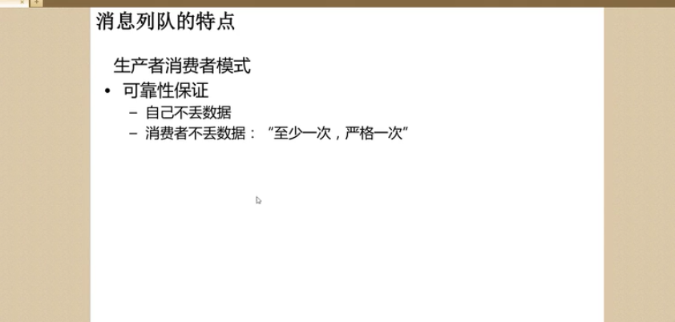
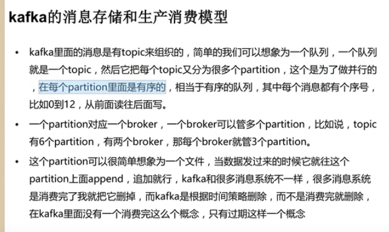
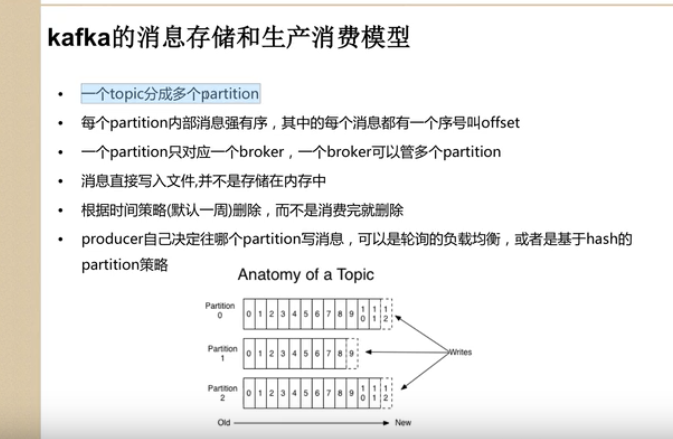
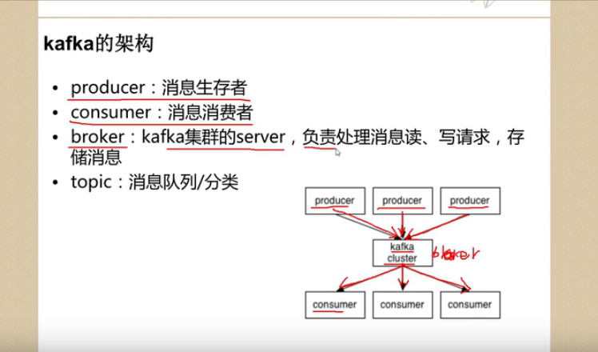
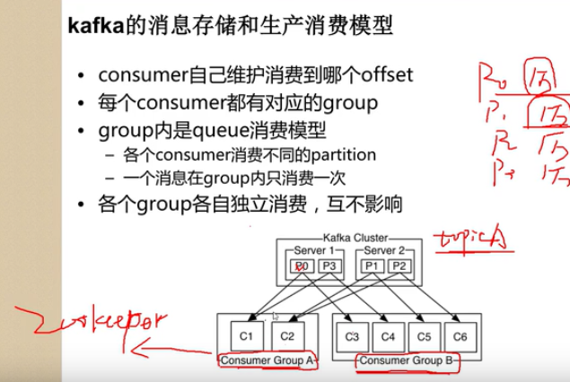
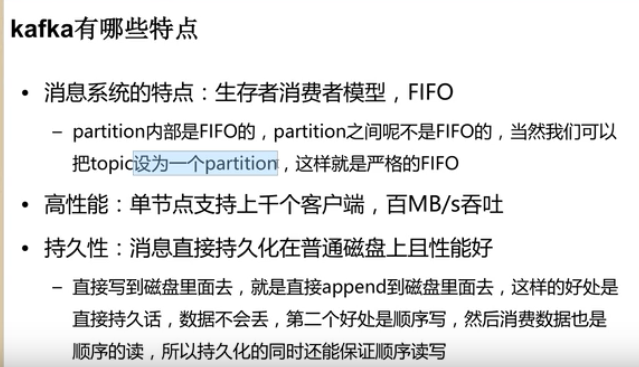
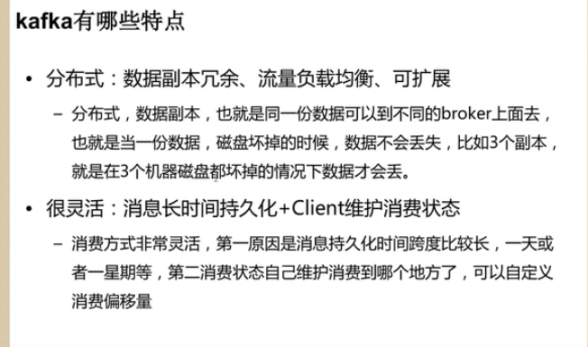

## 今天开始学习kafka...

起因是面试中被问及是否了解中间件，知道kafka是但具体干啥的不清楚，之前学习Spark时也有kafka这么一条路，不过当时没有顾及这个。还好现在还不晚，今天开始学吧！

资料来源于网络，一是B站上的一门课（搜索Kafka排名第一的那个就是），二是之前在Coding Now项目中收集的相关资源：[kafka中文教程](<http://orchome.com/kafka/index>)、[apache kafka技术分享系列(目录索引)](https://blog.csdn.net/lizhitao/article/details/39499283)，三是 [Kafka文档](http://kafka.apachecn.org)

### 介绍

文档上说Kafka是分布式流处理平台，用于构建实时的数据管道和流式的app，可以水平扩展，高可用，速度快

其有三大特性：

- 类似消息队列，采用发布/订阅模式
- 储存流式的记录，有一定容错性
- 产生流式数据时即可一定程度地处理

两大应用：

1. 构造实时流数据管道，它可以在系统或应用之间可靠地获取数据。 (相当于message queue)
2. 构建实时流式应用程序，对这些流数据进行转换或者影响。 (就是流处理，通过kafka stream topic和topic之间内部进行变化)

数据格式：key，value，timestamp（时间戳）

客户端和服务器间的网络协议是[使用TCP协议](https://kafka.apache.org/protocol.html#protocol_network) 

对于topic来说是有副本的，n个副本为了保证数据不丢失，所以不可超过n-1个broker挂机

### 消息队列

有两种消息队列，点对点队列的、发布-订阅式的。队列，消费者池中**一个**消费者从server读取数据，缺点是非多订阅者模式（一旦一个进程读取了数据就会被抛弃）无并发之意，好处是可以自定义扩展。发布-订阅，会推送到所有订阅者，但缺点是无法扩展

在kafka中综合了这两者，可以扩展处理并且允许多订阅者模式，看过下文可以知道Consumer 有group组的概念，server包含的消息会分发给组中的一系列Consumer（队列），也可以把消息广播推送给多个group组（发布-订阅）

kafka的优点，并行处理数据，顺序消费数据，负载均衡，

### 作为存储系统存储流式记录

Kafka将数据写磁盘并备份，可存储大量数据有很好的扩展性，可通过客户端控制读取数据的位置

> 官方文档中指明，Kafka可作为高性能、低延迟、具备日志存储、备份和传播功能的分布式文件系统

### 流处理

进行实时的流处理，对于简单的数据变换可以直接用生产者和消费者的API，对于复杂的数据变换Kafka提供Streams API，比如join、group聚合

Streams API建立在Kafka的核心之上：它使用Producer和Consumer API作为输入，使用Kafka进行有状态的存储， 并在流处理器实例之间使用相同的消费组机制来实现容错

### Kafka相关名词

消息队列一大作用就是消费者/生产者模型，所以自然就有Producer、Consumer用来写、读消息。

其次消息也会存储在消息队列中，Kafka中消息队列是topic，一个topic是一类消息有多个partition分区，多个topic放在一个broker中。

怎么看这几个名词？broker是kafka集群的节点，可以看作装消息的箱子，箱子里自然可以装多种消息了。这里得先说一下，Kafka没有主从结构，所以就没啥主broker从broker的。而partition以前学大数据知道这是分布式的特性，Kafka也是分布式的自然也有分区，其意义是使多个Consumer可以并发读取消息，Partition是创建topic时自己设置的，也代表了并行度。这里还有一点忘了说，Partition另外一个作用是避免文件大小超过单个节点的磁盘可容纳的大小，所以分区可以允许文件进行扩展存储到多台节点上。

在每个topic中又有offset偏移，其指的是消息的位置，在分区中唯一标识每条消息，之后可以看到这个offset是Consumer自己维护的。队列有FIFO特性，肯定读写消息时要通过offset来判断读哪个写哪里对吧。

对了，还有副本，这也是大数据的特性之一。

然后是kafka不负责管理，其依赖zookeeper来管理元数据：比如broker id、Consumer维护的offset（也可以不选择zookeeper管理）等

#### 聊聊分布式

从上面可以看处Partition保证分布式，这里姑且把Kafka节点称作server，server在处理数据和请求时共享Partition，每一个Partition也会在对应的server上备份来确保容错性。在这些server中，每个Partition都会选择一个server作为leader来处理对Partition的读写请求，其余server作为follower来同步leader上的数据（一致性，也是因为备份）。leader挂了的话，也会选择一个follower作为新的leader（一般是broker id顺延下去的下一个broker），这也是集群的负载均衡

#### 再看Producer 和 Consumer

生产者向磁盘写数据时有两种方式，默认是依key的hash值写到对应Partition中，以及使用轮询方式写入Partition（这样可以简易的实现负载均衡，因为hash到某个分区可能会造成数据倾斜），当然这里是针对一个topic的分区。Partition细谈一下，有学过其他大数据组件的话，可以知道Partition其实就是对应一个目录，而目录中存的是数据文件、索引这些，有数据写入时就是向文件中append追加数据。Partition可以在创建topic时指定，**也可以从配置文件中读取指定配置？？？？？？？？？**

生产者消费数据，从图中可看出Consumer还有一个group(组)的概念，常理也知道并发问题肯定会有多个消费者消费同一类消息对吧。组内有多个消费者实例方便扩展和容错。这里有几点要注意：

- 一个Consumer一次只读取一个Partition

- 多个Consumer并行读取多个Partition

- 同一个group内的Consumer**同一时刻**不能消费同一个Partition，不同组无影响，像C1、C2不能同时读P0，但C1、C3可同时读P0

  - 这里有一个同一时刻的概念，因为像P0，C1可以先读100条数据（假设从offset=0开始读），之后C2同样可以读P0（但要从第101条开始读，即**同组内相同数据不可被重复读**）

- 如果所有的消费者实例在同一消费组中，消息记录会负载平衡到每一个消费者实例.

  如果所有的消费者实例在不同的消费组中，每条消息记录会广播到所有的消费者进程.

- Consumer组内的Consumer实例数不能超过Partition分区数

文档中指出了，Kafka协议动态处理组中的消费关系。如果新的Consumer实例加入组，他们将从组中其他成员处接管一些 partition 分区;如果一个Consumer实例消失，拥有的分区将被分发到剩余的Consumer实例上。

还有就是读数据时虽然是消息队列，但也只是保证每个topic是FIFO的读取，总体上来说是无序的读

### 核心API

如图，消息队列中的生产者/消费者API，负责流处理的Stream API，连接数据库或者应用程序的API

> Stream API是消费一或多个topic队列中的输入流，并进行相应转换，产生一或多个输出流到一或多个topic中去

