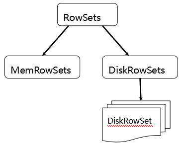
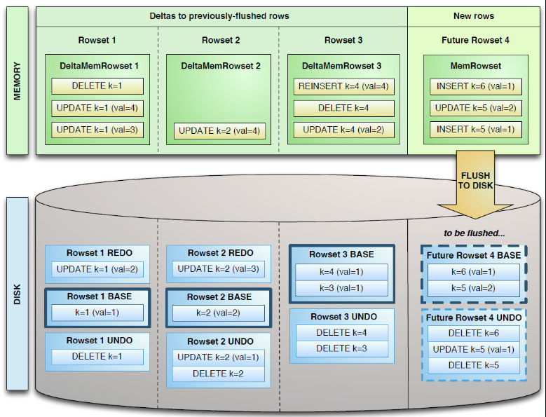

## Kudu入门

### 概述
官方的定位是**fast analytics on fast data**，快速更新的数据上进行快速查询，但不适合大量的随机访问（官方建议使用HBase），但和HBase非常相似，支持索引键的查询和修改。网易有篇Kudu和HBase对比的文章，[分布式存储系统Kudu与HBase的简要分析与对比](https://zhuanlan.zhihu.com/p/44517915)

平衡随机读写和批量分析的性能
***
一张Table表数据被分割成多个Tablet（看作表的水平分区），Table具有 schema 和**全局有序**的primary key

Master
Kudu的master节点负责整个集群的元数据管理和服务协调。它承担着以下功能：

作为catalog manager，master节点管理着集群中所有table和tablet的schema及一些其他的元数据。
作为cluster coordinator，master节点追踪着所有server节点是否存活，并且当server节点挂掉后协调数据的重新分布。
作为tablet directory，master跟踪每个tablet的位置。

Catalog Manager
Kudu的master节点会持有一个单tablet的table——catalog table，但是用户是不能直接访问的。master将内部的catalog信息写入该tablet，并且将整个catalog的信息缓存到内存中。随着现在商用服务器上的内存越来越大，并且元数据信息占用的空间其实并不大，所以master不容易存在性能瓶颈。catalog table保存了所有table的schema的版本以及table的状态（创建、运行、删除等）。

>catalog table是Kudu元数据的中心位置。它存储有关table和tablet的信息。catalog table无法直接读取或写入，只能通过client 的API中公开的元数据进行操作访问。
>catalog table存储两类元数据信息：
>  - table的Schema、location、states状态
>  - 存活的tablets的序列，tablet的副本保存在哪台Tablet Server上，tablet当前state状态、和start and end keys（？？？）

Cluster Coordination
Kudu集群中的每个tablet server都需要配置master的主机名列表。当集群启动时，tablet server会向master注册，并发送所有tablet的信息。tablet server第一次向master发送信息时会发送所有tablet的全量信息，后续每次发送则只会发送增量信息，仅包含新创建、删除或修改的tablet的信息。
作为cluster coordination，master只是集群状态的观察者。对于tablet server中tablet的副本位置、Raft配置和schema版本等信息的控制和修改由tablet server自身完成。master只需要下发命令，tablet server执行成功后会自动上报处理的结果。
Tablet Directory
因为master上缓存了集群的元数据，所以client读写数据的时候，肯定是要通过master才能获取到tablet的位置等信息。但是如果每次读写都要通过master节点的话，那master就会变成这个集群的性能瓶颈，所以client会在本地缓存一份它需要访问的tablet的位置信息，这样就不用每次读写都从master中获取。
因为tablet的位置可能也会发生变化（比如某个tablet server节点crash掉了），所以当tablet的位置发生变化的时候，client会收到相应的通知，然后再去master上获取一份新的元数据信息。

### Tablet的存储模型
Tablet会被划分为更小的存储单元，RowSets，不相交的Rows的集合。Row是表中一行数据，不相交指的是Tablet中任何一行没有被delete掉的数据只会存在一个RowSet中。如图所示，RowSets又分为MemRowSets和DiskRowSets两类，前者存储在内存中，后者保存在内存和磁盘中

一个TaTablet只有一个MemRowSet，用来存储新增数据，多个DiskRowSets。且会有一个后台线程定期地将该MemRowSet的数据flush刷新到磁盘中，变成一或多个DiskRowSet，当然也会产生新的一个MemRowSet代替原有的MemRowSet。刷新这个动作也是并发进行的，当刷新MemRowSet同时也可以读取其中数据，而rows的更新和删除会被跟踪并在刷新完成后滚动到磁盘的数据中

这样做的好处是：
- 快速的列式查询，Parquet(hdfs结构)的优点
- 低延迟的随机更新，HBase的优点
- 一致性的性能，可提供更为稳定的查询性能保障

#### MemRowSet
MemRowSet的实现是基于Mass Tree的设计，一个支持并发访问、进行过锁优化、存储在内存中的B-tree，但有以下不同之处：
- 删除操作并非直接从tree中删除，而是借助MVCC进行延迟删除，插入一条标志删除的数据。MemRowSets刷新到磁盘时，可以将这些记录的删除
- 类似地也不支持直接更新操作
- 像B+树一样将叶子节点通过链表相连，可以提供扫描的性能
- 没有实现完整的字典树（trie of trees），而只是单一的tree，不适合极高的随机访问吞吐量的应用场景

MemRowSet的叶节点是256字节，这是为了更好地随机扫描。不同于其他模快，MemRowSet是以行式存储的形式的数据结构，因为保存在内存中，所以性能可以接受。MemRowSet还进行了许多性能上的优化，比如对主键进行保持顺序（order-preserving）的编码，使得tree中只需要内存中遍历比较操作（memcmp operations），而且排序特性允许高效地扫描主键范围和单个列的查找

#### DiskRowSet
MemRowSet刷新到磁盘中，每32M一个单位，按序形成一个DiskRowSet。保证了每个DiskRowSet不会太大，便于后续的增量compaction操作
> **Compaction操作**：Kudu会定期进行的操作，对上面提及的标记了删除的数据进行删除，下文会提到的合并delta data与base data，并且会合并一些DiskRowSet

DiskRowSet是和Parquet一样按列存储的，每列数据被存储在相邻的数据区域，该数据区域进一步被划分成更小的Page单元，使用B-tree进行索引，kudu还会将主键索引存在一个列中，可以通过布隆过滤器快速查找。对每个列Page还可以采用编码和压缩算法。
重要的是DiskRowSet分为两部分：*base data*（基础数据）和*delta stores*（变更存储），用来进行删除、更新操作，即删除、更新操作所生成的数据记录，被保存在*delta stores*部分。官网给了张图，如下。除了BASE记录，*delta stores*包含REDO和UNDO两类数据。
> 参考：<http://www.nosqlnotes.com/technotes/kudu-design/>
> 和关系型数据库中的REDO与UNDO日志类似（在关系型数据库中，REDO日志记录了更新后的数据，可以用来恢复尚未写入Data File的已成功事务更新的数据。 而UNDO日志用来记录事务更新之前的数据，可以用来在事务失败时进行回滚），但也存在一些细节上的差异：
>- REDO Delta Files包含了Base Data自上一次被Flush/Compaction之后的变更值。REDO Delta Files按照Timestamp顺序排列。
>- UNDO Delta Files包含了Base Data自上一次Flush/Compaction之前的变更值。这样才可以保障基于一个旧Timestamp的查询能够看到一个一致性视图。UNDO按照Timestamp倒序排列。

### Hadoop集成
- 集成MR、Spark
Kudu是在Hadoop生态系统的背景下构建的，提供和MapReduce、Spark组件的集成。可以和MR、Spark作业绑定，输入输出到 Kudu 表

[参考：Kudu和Spark集成](https://kudu.apache.org/docs/developing.html#_kudu_integration_with_spark)
[参考：Kudu和MapReduce、Yarn等框架集成](https://kudu.apache.org/docs/developing.html#_integration_with_mapreduce_yarn_and_other_frameworks)
- 集成Impala

[参考：Kudu和Impala集成使用](https://kudu.apache.org/docs/kudu_impala_integration.html)

### 应用
我谷歌搜索了相关内容，列出以下几篇技术博客，是在一些互联网公司较成熟的应用

- [实时性和完整性兼得，使用 Kudu 和 Impala 实现透明的分层存储管理](https://zhuanlan.zhihu.com/p/65593795)
- [Kudu+Impala介绍 | 微店数据科学团队博客](https://juejin.im/entry/5a72d3d1f265da3e4d730b37)
- [Kudu架构介绍及其在小米的应用实践](https://myslide.cn/slides/7596)
- [使用Kudu搭建OLAP云服务](https://myslide.cn/slides/3584)
- [Kudu在使用过程中的各种限制](https://blog.csdn.net/xueyao0201/article/details/80874583)

### Kudu+Impala集群安装
安装cdh版本，找对应匹配的版本，和hadoop、hive哪些没关系。我看了下官网是从源码开始一步一步安装的，也不知道会有什么问题，我公司有专门负责软件安装平台搭建的工程师，所以搭建这一块我更本就没过手，O(∩_∩)O哈哈~
参考：
- [Installing Apache Kudu](https://kudu.apache.org/docs/installation.html)
- [Apache Kudu集群安装](https://blog.csdn.net/wangpei1949/article/details/80032933)
- [impala-kudu安装](https://blog.csdn.net/mr_jack_xu/article/details/54135150)