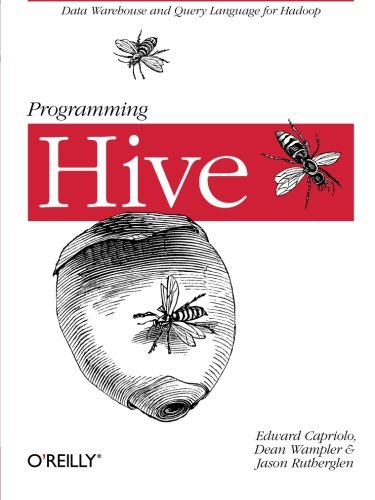
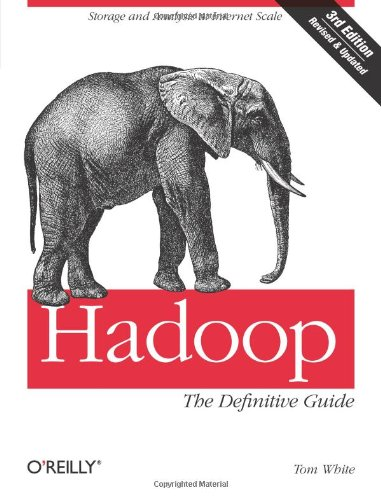
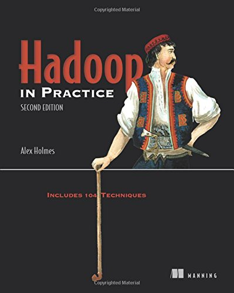

# BigData-Learning

[Coding Now](https://github.com/josonle/Coding-Now)那个项目规划的太乱了，所以想着把自己大数据相关的东西单独提出了，所以本项目只是记录自己的心得和看过的一些资源吧，至于平时看过的比较好的文章还是会放到Coding Now中

> “古今之成大事业、大学问者，必经过三种之境界：‘昨夜西风凋碧树。独上高楼，望尽天涯路’。此第一境也。‘[衣带渐宽终不悔](https://www.baidu.com/s?wd=%E8%A1%A3%E5%B8%A6%E6%B8%90%E5%AE%BD%E7%BB%88%E4%B8%8D%E6%82%94&tn=SE_PcZhidaonwhc_ngpagmjz&rsv_dl=gh_pc_zhidao)，为伊消得人憔悴。’此第二境也。‘[众里寻他千百度](https://www.baidu.com/s?wd=%E4%BC%97%E9%87%8C%E5%AF%BB%E4%BB%96%E5%8D%83%E7%99%BE%E5%BA%A6&tn=SE_PcZhidaonwhc_ngpagmjz&rsv_dl=gh_pc_zhidao)，蓦然回首，那人却在，灯火阑珊处’。此第三境也。”
>
> 语出——王国维《人间词话》

我想学习思考也无非这三重境界，“初窥门庭”、“渐入佳境”、“登堂入室”，便突发奇想以这三个名字来记录学习每一类框架的过程，若是有实际应用便取名“班门弄釜”好了

## Kafka篇
- [初窥门庭Kafka](https://github.com/josonle/BigData-Learning/blob/master/Kafka/)

### 资源
- B站上搜索Kafka排名第一的哪个视频
- [Coding Now项目](https://github.com/josonle/Coding-Now)中收集的相关资源：
    - [kafka中文教程](<http://orchome.com/kafka/index>)
    - [apache kafka技术分享系列(目录索引)](https://blog.csdn.net/lizhitao/article/details/39499283)
    - [Kafka文档](http://kafka.apachecn.org)

## ZooKeeper篇

- [初窥门庭ZooKeeper](https://github.com/josonle/BigData-Learning/blob/master/ZooKeeper/)
- [分布式一致性原理](https://github.com/josonle/BigData-Learning/blob/master/ZooKeeper/)
- [渐入佳境ZooKeeper](https://github.com/josonle/BigData-Learning/blob/master/ZooKeeper/)
- [登堂入室ZooKeeper](https://github.com/josonle/BigData-Learning/blob/master/ZooKeeper/)

### 资源

- 尚硅谷的视频，B站有
- 《从Paxos到ZooKeeper 分布式一致性原理与实践》
- 博客系列
  - [ZooKeeper从入门到专家](https://blog.csdn.net/wo541075754/column/info/14599)
  - [跟着实例学习ZooKeeper的用法](https://colobu.com/2014/12/16/zookeeper-recipes-by-example-summary/)
  - [ZooKeeper八期学习-博客园-Sunddenly(⊙_⊙)](https://www.cnblogs.com/sunddenly/category/620563.html)
  - 找到的[ZooKeeper教程资源收集（简介/原理/示例/解决方案）](http://www.cnblogs.com/EasonJim/p/7481825.html)

## Hadoop篇

### HDFS和YARN
- HDFS 架构学习总结
- YARN 架构学习
> [转载自 Matt's Blog 原作者：王蒙](https://github.com/josonle/Coding-Now/tree/master/%E5%A4%A7%E6%95%B0%E6%8D%AE/hadoop%E7%B3%BB%E5%88%97/%E8%BD%AC%E8%BD%BD)

### MapReduce

- [MapReduce编程学习练手实例](https://github.com/josonle/MapReduce-Demo)

## Hive篇

- [Hive回顾一](https://github.com/josonle/BigData-Learning/blob/master/Hive/Hive%E5%9B%9E%E9%A1%BE%E4%B8%80.md)
- [Hive回顾二](https://github.com/josonle/BigData-Learning/blob/master/Hive/Hive%E5%9B%9E%E9%A1%BE%E4%BA%8C.md)
- [Hive面试该准备些什么?](https://github.com/josonle/BigData-Learning/blob/master/Hive/Hive%E9%9D%A2%E8%AF%95%E8%AF%A5%E5%87%86%E5%A4%87%E4%BA%9B%E5%95%A5%EF%BC%9F.md)
- [Hive simple easy learning](https://www.tutorialspoint.com/hive/index.htm)
  - 国外的hive入门学习教程，还能练习HQL（不足就是要学好English，O(∩_∩)O哈哈~）
  - Hive - Useful Resources
  > [Hive Getting Started](https://cwiki.apache.org/confluence/display/Hive/GettingStarted)
  > 

## HBase篇
- HBase入门————[《HBase不睡觉》](http://kittyandpuppy.coolplayer.net/HBase.pdf)
- 《HBase实战》见 [ebook](https://github.com/josonle/Coding-Now#eBook%E5%92%8C%E8%A7%86%E9%A2%91%E8%B5%84%E6%BA%90)
- [一条数据的HBase之旅，简明HBase入门教程](http://www.nosqlnotes.com/technotes/hbase/hbase-overview-concepts/)

## Spark篇

- [Learning Spark项目](https://github.com/josonle/Learning-Spark)
- [《Spark The Definitive Guide Learning》Spark权威指南学习心得、笔记](https://github.com/josonle/Spark-The-Definitive-Guide-Learning)
