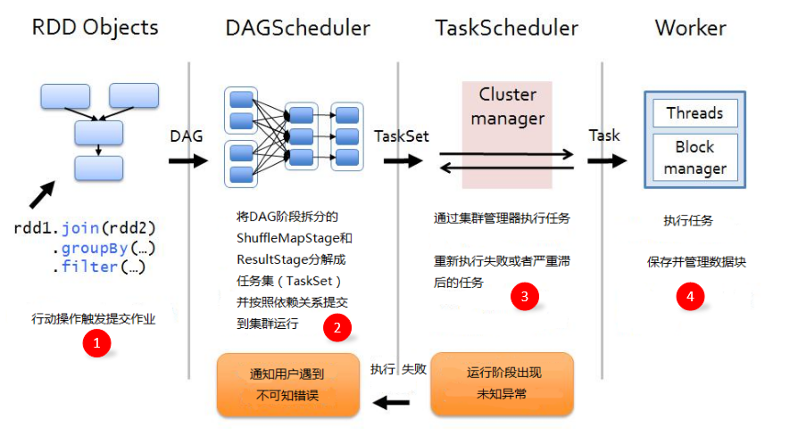

> 图片引自：[庄涵的专栏](https://cloud.tencent.com/developer/column/1185)，这张图也不知道出处在哪，我看耿家安老师的书里也是这张图

- DAG图构建阶段

Spark提交一个作业Job，Job中含有一系列RDD的操作，RDD间又有依赖关系，就能构建DAG图

- DAGScheduler阶段

DAGScheduler负责将DAG图划分为Stage，依据宽依赖。DAGScheduler接受的DAG图来自Job中进行一系列RDD的转换并依赖RDD之间的依赖关系构建而成。Stage又分为ResultStage和ShuffleMapStage，其中由一组Task组成（即TaskSet），分为ResultTask和ShuffleMapTask。TaskSet后续会交付给TaskScheduler处理，下面就是。

- TaskScheduler阶段

TaskScheduler接受DAGScheduler传递来的TaskSet，然后创建TaskSetManager来管理这些TaskSet，并将TaskSetManager放入调度池。Task的调度又由SchedulerBackend调度后端接口处理，SchedulerBackend会先申请TaskScheduler，然后采取FIFO或者FAIR调度算法对调度池中的TaskSetManager进行排序，然后会采取最大本地性原则为TaskSet分配资源，Task提交到对应的节点上去执行。

ClusterManager分配资源和任务调度，并且对失败的Task有一定重试和容错机制

- task执行阶段

### RDD理解

RDD是调度系统主要操作的对象，所以要理解RDD

#### RDD五大特性

- A list of partitions

一个分区列表，RDD中的数据都存在一个分区列表里面

- A function for computing each split

作用在每一个分区中的函数

- A list of dependencies on other RDDs

一个RDD依赖于其他多个RDD，这个点很重要，RDD的容错机制就是依据这个特性而来的

- Optionally, a Partitioner for key-value RDDs (e.g. to say that the RDD is hash-partitioned)

可选的，针对于kv类型的RDD才具有这个特性，作用是决定了数据的来源以及数据处理后的去向

- Optionally, a list of preferred locations to compute each split on (e.g. block locations for an HDFS file)

可选的，数据本地性，计算每个数据位置最优切分位置

