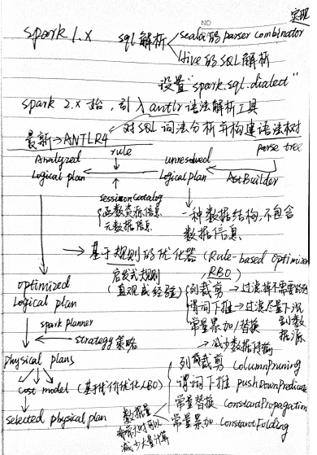

# Spark是如何处理一条SQL的
阅读：
- [一条 SQL 在 Apache Spark 之旅（上）](https://www.iteblog.com/archives/2561.html)
- [一条 SQL 在 Apache Spark 之旅（中）](https://www.iteblog.com/archives/2562.html)
- [一条 SQL 在 Apache Spark 之旅（下）](https://www.iteblog.com/archives/2563.html)

