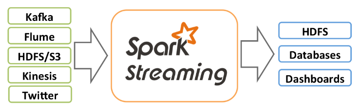
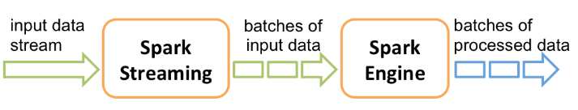
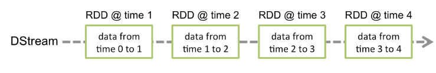
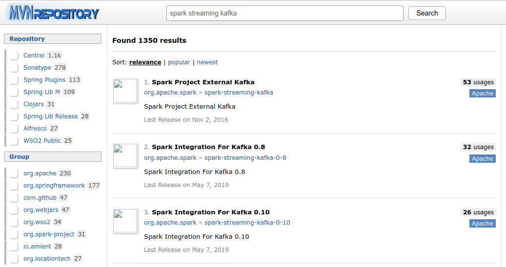
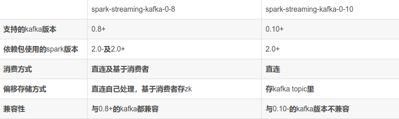
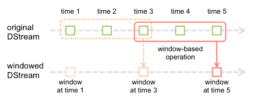
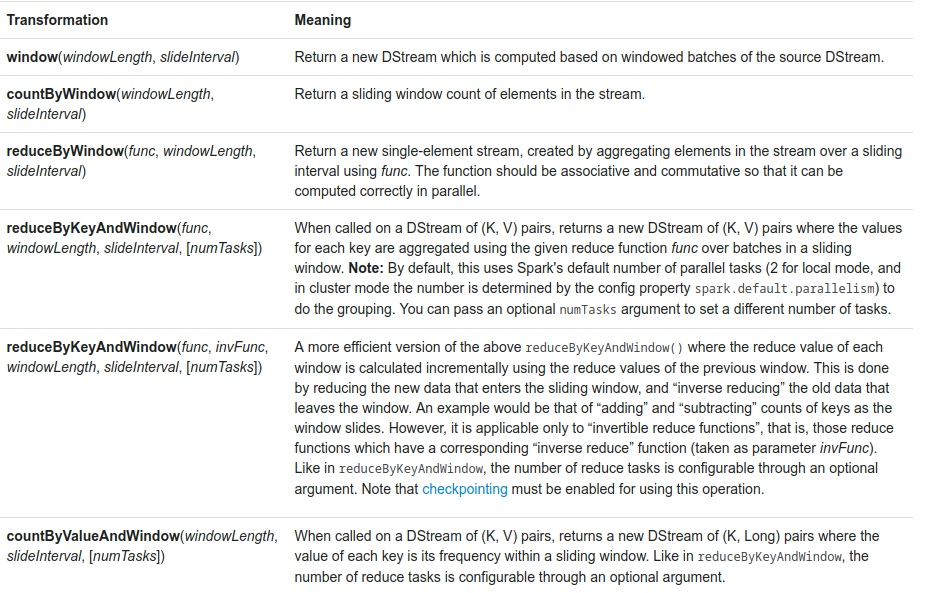
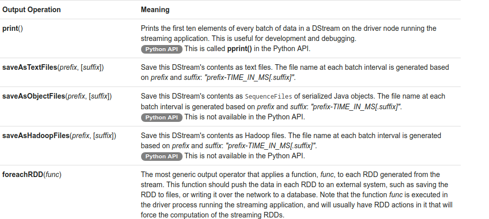

# Spark Streaming入门概览
> Spark Streaming 已经过时了，这是spark 1.x的流数据处理系统
> Structured Streaming 是进行时，这是spark 2.x的流数据处理系统
> 但还是了解一下好吧


内部工作原理如下图，输入数据流经Spark Streaming切分成多个批次（batche）的输入数据，传给Spark引擎处理，输出为处理后的结果数据


Spark 自12年以来就纳入了Spark Streaming组件和其一个更高级层次的API——DStream（discretized stream，离散流），用以表示连续的数据流。DStream既可以利用从Kafka, Flume和Kinesis等源获取的输入数据流创建，也可以在其他DStream的基础上通过高阶函数获得。DStream内部也是由一系列连续的RDDs组成，每个RDD都包含确定时间间隔内的数据，如图


DStream支持scala、java、python，但**只支持基本的源如文本文件或者套接字上的文本数据**，诸如flume、kafka等外部的源的API会在将来引入

DStreams API 基于对 java / python 对象的相对低级的操作，这限制了更高级别优化的机会，因此在16年Spark又引入了另外一个组件Structured Streaming——一个直接构建在DataFrame上的流API，支持丰富的优化以及和其他DataFrame、DataSet代码更加简单显著地集成。Spark 2.2之后Structured Streaming被标记为stable稳定的，大量推广

## 添加相关源的依赖
为了从Kafka, Flume和Kinesis这些不在Spark核心API中提供的源获取数据，我们需要添加相关的`模块spark-streaming-xyz_{scala_version}`到依赖中，[到此网站搜索](https://mvnrepository.com/search?q=)

比如说Kafka相关依赖，会有如图三个依赖包可选


> 参考：[spark streaming消费kafka maven依赖选择](https://blog.csdn.net/zhaolq1024/article/details/85685189)
> 

```xml
<!-- https://mvnrepository.com/artifact/org.apache.spark/spark-streaming-kafka-0-10 -->
<dependency>
    <groupId>org.apache.spark</groupId>
    <artifactId>spark-streaming-kafka-0-10_2.11</artifactId>
    <version>2.4.0</version>
</dependency>
```
## 初始化SparkStreaming程序
像spark-core、spark-sql一样都要有一个入口，这里是StreamingContext对象，简写为ssc
```scala
import org.apache.spark._
import org.apache.spark.streaming._
val conf = new SparkConf().setAppName(appName).setMaster(master)
//利用conf
val ssc = new StreamingContext(conf, Seconds(1))
//或者有sc，利用sc
val ssc = new StreamingContext(sc,Seconds(1))
```
它也和SparkSession一样内部创建了一个SparkContext对象，可通过`ssc.sparkContext`获取

当一个上下文（context）定义之后，你必须按照以下几步进行操作
  - 定义输入源；
  - 准备好流计算指令；
  - 利用streamingContext.start()方法接收和处理数据；
  - 处理过程将一直持续，直到streamingContext.stop()方法被调用。

几点需要注意的地方：
  - 一旦一个context已经启动，就不能有新的流算子建立或者是添加到context中。
  - 一旦一个context已经停止，它就不能再重新启动
  - 在JVM中，同一时间只能有一个StreamingContext处于活跃状态
  - 在StreamingContext上调用stop()方法，也会关闭SparkContext对象。如果只想仅关闭StreamingContext对象，设置stop()的可选参数为false
  - 一个SparkContext对象可以重复利用去创建多个StreamingContext对象，前提条件是前面的StreamingContext在后面StreamingContext创建之前关闭（不关闭SparkContext）

## 输入DStreams和Receivers
每个输入DStream（文件流除外，本节稍后讨论）都与一个Receiver对象（运行在Spark worker或executor中）相关联，该对象从源接收数据并将其存储在Spark的内存中进行处理
输入DStreams支持**基本数据源**，像文件系统、套接字连接，以及需要添加额外依赖的**高级数据源**，像Kafka、Flume
可以创建多个输入DStream来接受多个数据源的数据，相应就将会创建多个Receiver接受数据，而一个Receiver会占用一个核（分配给Spark Streaming应用程序的一个核），所以要确保分配的核够用
>- 如果分配给应用程序的核的数量少于或者等于输入DStreams或者receivers的数量，系统只能够接收数据而不能处理它们。
> - 当运行在本地，如果你的master URL被设置成了“local”，这样就只有一个核运行任务。这对程序来说是不足的，因为作为receiver的输入DStream将会占用这个核，这样就没有剩余的核来处理数据了

### 文件流
可以从任何与HDFS API兼容的文件系统中读取数据，如此创建`StreamingContext.fileStream[KeyClass, ValueClass, InputFormatClass](目录)`，最简单的像文本文件可通过`StreamingContext.textFileStream(目录)`创建

>** 文件流不需要创建Receiver对象来接受数据，所以也不需要分配核**

- 如何监控一个目录？
  - 像`hdfs://master:9000/logs/`，所有在该目录下的文件在发现时就会被处理
  - 也支持目录的模式匹配，像`hdfs://master:9000/logs/*`
  - 要求所有文件的数据格式相同
  - 根据文件的修改时间，会把它分到不同时间周期去。比如说2到4秒这个时间间隔，刚好有个文件在此期间修改了，它就属于这个窗口
  - 文件处理后，对当前窗口中的文件所做的更改将不会导致文件被重新读取
  - 目录下文件越多，扫描时间花费越多，即使文件没有被修改
  - 调用 FileSystem.setTimes ()来修改时间戳是在后续的窗口中提取文件的一种方法，即使其内容没有更改

### RDDs队列作为Stream
基于RDD的队列来创建一个DStream
```scala
def queueStream[T](queue: Queue[RDD[T]], oneAtATime: Boolean = true)(implicit arg0: ClassTag[T]): InputDStream[T]
```

### 高级数据源作为Stream
前面说过要添加相应依赖
>**注意**，Spark shell中不提供这些高级源，因此无法在shell中测试基于这些高级源的应用程序。如果您真的想在Spark shell中使用它们，则必须下载相应的Maven工件JAR及其依赖项，并将其添加到类路径中

### 自定义源作为Stream
Python不支持。需要自定义Receiver，参考[自定义Receiver](https://spark.apache.org/docs/2.4.0/streaming-custom-receivers.html)

## DStream上的转换操作
类似RDDs上的转换算子，DStream也支持很多类似的，[参见 Transformations on DStreams](https://spark.apache.org/docs/2.4.0/streaming-programming-guide.html#transformations-on-dstreams)

有四类操作是不同的，UpdateStateByKey、Transform、Window、Join Operations
### UpdateStateByKey 操作

### Transform 操作
- `transform(func)`，允许在DStream运行任何RDD-to-RDD函数。它能够被用来应用任何没在DStream API中提供的RDD操作
  > 注意，在每个批次处理间隔中都会调用提供的函数func。这允许您进行随时间改变的RDD操作，即RDD操作，分区数，广播变量等可以在batche（批次）之间进行更改。

### Window 操作
- 窗口操作，允许在一个滑动窗口数据上应用transformation算子，如下图
  - 需要两个参数设置：window length窗口长度，即窗口的持续时间、sliding interval滑动间隔，即窗口操作执行的时间间隔，图中是3个时间单元的长度以及每个两个时间单元滑动
  - 以上两个参数必须是源DStream的批时间间隔（下图是1个时间单元）的倍数


窗口操作相关函数如图：


注意上图中的numTasks参数，在默认情况下，这个算子利用了Spark默认的并发任务数（local模式是2，可在配置中`spark.default.parallelism`设置）去group操作。你可以用numTasks参数设置不同的任务数

### Join 操作
Spark Streaming中可以执行不同类型的join连接操作

```scala
val stream1: DStream[String, String] = ...
val stream2: DStream[String, String] = ...
val joinedStream = stream1.join(stream2)
```
在每个batche（批次）上stream1生成的RDD会和stream2生成的RDDjoin，同样支持leftOuterJoin、rightOuterJoin、fullOuterJoin
```scala
val windowedStream1 = stream1.window(Seconds(20))
val windowedStream2 = stream2.window(Minutes(1))
val joinedStream = windowedStream1.join(windowedStream2)
```
也支持在流的窗口上join操作
```scala
val dataset: RDD[String, String] = ...
val windowedStream = stream.window(Seconds(20))...
val joinedStream = windowedStream.transform { rdd => rdd.join(dataset) }
```
还可以借助`DStream.transform`方法使得Stream和DataSet执行join
***
更多API可以参考：[scala的DStream](https://spark.apache.org/docs/2.4.0/api/scala/index.html#org.apache.spark.streaming.dstream.DStream)和[PairDStreamFunctions](https://spark.apache.org/docs/2.4.0/api/scala/index.html#org.apache.spark.streaming.dstream.PairDStreamFunctions)

## 输出操作


- `print`打印DStream中每个批次数据中的前十个
- 接下来三个方法依次是保存为文本文件、序列化文件SequenceFile、hadoop文件，每个批次间隔生成的文件名基于prefix和suffix，形式为`prefix-TIME_IN_MS[.suffix]`
- `foreachRDD`，在从流中生成的每个RDD上应用函数func的最通用的输出操作。这个函数应该推送每个RDD的数据到外部系统，例如保存RDD到文件或者通过网络写到数据库中。需要注意的是，func函数在驱动程序中执行，并且通常都有RDD action在里面推动RDD流的计算

## DataFrame 和 SQL操作
你必用StreamingContext使用的SparkContext来创建一个SparkSession，这样做可以在Driver程序出故障时重起（这是通过创建一个延迟实例化的SparkSession单例实例来达到的）。将DStream中每个RDD转为DataFrame并且注册为临时表，就可以使用相关DataFrame API和SQL进行查询了。下文是example中的词频统计
```scala
/** DataFrame operations inside your streaming program */

val words: DStream[String] = ...

words.foreachRDD { rdd =>

  // Get the singleton instance of SparkSession
  val spark = SparkSession.builder.config(rdd.sparkContext.getConf).getOrCreate()
  import spark.implicits._

  // Convert RDD[String] to DataFrame
  val wordsDataFrame = rdd.toDF("word")

  // Create a temporary view
  wordsDataFrame.createOrReplaceTempView("words")

  // Do word count on DataFrame using SQL and print it
  val wordCountsDataFrame = 
    spark.sql("select word, count(*) as total from words group by word")
  wordCountsDataFrame.show()
}
```

## 缓存和持久化操作
同样是有`cache`和`persist`方法，不过不同于RDD的缓存操作是，DStream中缓存统一都要序列化的，默认`MEMORY_ONLY_SER`
还有像reduceByWindow、reduceByKeyAndWindow这类基于窗口的操作，和updateStateByKey基于状态的操作，默认是隐含开启了持久化机制，无序手动调用persist
对于通过网络接收数据的输入流（例如，Kafka，Flume，套接字等），默认storageLevel设置为将数据复制到两个节点以实现容错，即多复制一份`MEMORY_ONLY_SER_2`

## 检查点机制
checkpoint检查点机制就是为了失败能够从错误中恢复，有两类数据需要被设置检查点：
- Metadata checkpointing：用于从运行流应用程序的**Driver程序的节点的故障中恢复**（要求集群支持Driver挂掉后重启），保存Stream的定义信息到容错存储系统中，像hdfs。Metadata包含：
  - Configuration：创建流应用程序的配置
  - DStream operations：定义流应用程序的DStream操作集合
  - Incomplete batches：作业存在队列中但还未完成的批次
- Data checkpointing：这个是保存之前已生成的RDDs到可靠存储系统中，像hdfs。这在**有状态transformation操作**（如结合跨多个批次的数据）中是必须的。在这样一个transformation中，生成的RDD依赖于之前批次的RDD，随着时间的推移，这个依赖链的长度会持续增长。在恢复的过程中，为了避免这种无限增长。有状态的transformation的中间RDD将会定时地存储到可靠存储系统中，以截断这个依赖链
  - 像`updateStateByKey`、`reduceByKeyAndWindow`这种有状态的Transformation操作必须定期设置检查点

### 如何配置检查点
通过`streamingContext.checkpoint(checkpointDirectory)`方法，在容错、可信赖的文件系统（像hdfs、s3等等）中设置一个目录用来保存checkpoint信息
```scala
// 参考文档
// 必须通过一个函数来设置创建一个新的StreamingContext
def functionToCreateContext(): StreamingContext = {
  val ssc = new StreamingContext(...)   // new StreamingContext
  val lines = ssc.socketTextStream(...) // 创建DStreams
  ...
  ssc.checkpoint(checkpointDirectory)   // 设置检查点目录，比如hdfs://master:9000/sparkStreaming/checkpoint_dir/
  // RDD设置检查点
  lines.checkpoint(Seconds(batchDuration*5))  //这里指5倍的DStream滑动间隔
  // 或者直接对RDD checkpoint
  // lines.foreachRDD(rdd => rdd.checkpoint())
  ssc  // 返回ssc
}

// 在其他地方，比如main函数中，通过检查点获取ssc，或者创建一个
val context = StreamingContext.getOrCreate(checkpointDirectory, functionToCreateContext _)

// Do additional setup on context that needs to be done,
// irrespective of whether it is being started or restarted
context. ...

// Start the context
context.start()
context.awaitTermination()
```

```scala
// 源码案例中给的例子
object RecoverableNetworkWordCount {

  def createContext(ip: String, port: Int, outputPath: String, checkpointDirectory: String)
    : StreamingContext = {
    ...
    val sparkConf = new SparkConf().setAppName("RecoverableNetworkWordCount")
    // Create the context with a 1 second batch size
    val ssc = new StreamingContext(sparkConf, Seconds(1))
    ssc.checkpoint(checkpointDirectory)
    ...
    ssc
  }

  def main(args: Array[String]) {
    ....
    val Array(ip, IntParam(port), checkpointDirectory, outputPath) = args
    // 注意参数怎么传递的
    val ssc = StreamingContext.getOrCreate(checkpointDirectory,
      () => createContext(ip, port, outputPath, checkpointDirectory))
    ssc.start()
    ssc.awaitTermination()
  }
}
```
如果`checkpointDirectory`目录存在的话，就会利用checkpoint数据重新获取ssc；不存在的话，就会调用相应函数`functionToCreateContext/createContext`创建上下文、DStream

对于RDD的checkpoint设置还要考虑效率问题，存储成本。设置的小，checkpoint次数就多，存储空间占用也多。设置的大，恢复时丢失的数据、操作越多。默认的间隔时间是批次间隔时间的倍数，最少10秒。可以通过`dstream.checkpoint`来设置，官方推荐是5到10倍的DStream的滑动间隔（batch duration）

累加器(Accumulators)和广播变量(Broadcast Variables)是无法从检查点中恢复的，要实现这个功能，需要为累加器和广播变量创建懒实例化的单例实例，以便在Driver重新启动失败后重新实例化它们。参考：[累加器、广播变量的checkpoint实现](https://spark.apache.org/docs/2.4.0/streaming-programming-guide.html#accumulators-broadcast-variables-and-checkpoints)、[SparkStreaming程序中checkpoint与广播变量兼容处理](http://ileaf.tech/bigdata/2018/04/04/SparkStreaming%E7%A8%8B%E5%BA%8F%E4%B8%ADcheckpoint%E4%B8%8E%E5%B9%BF%E6%92%AD%E5%8F%98%E9%87%8F%E5%85%BC%E5%AE%B9%E5%A4%84%E7%90%86/)

# 资料分享
- [Spark Streaming 源码解析系列](https://github.com/lw-lin/CoolplaySpark/tree/master/Spark%20Streaming%20%E6%BA%90%E7%A0%81%E8%A7%A3%E6%9E%90%E7%B3%BB%E5%88%97)
- [Spark Streaming遇到问题分析](https://segmentfault.com/a/1190000010220294)