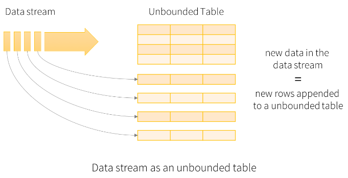
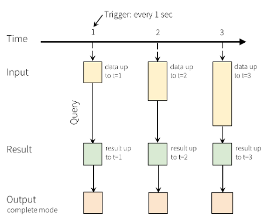
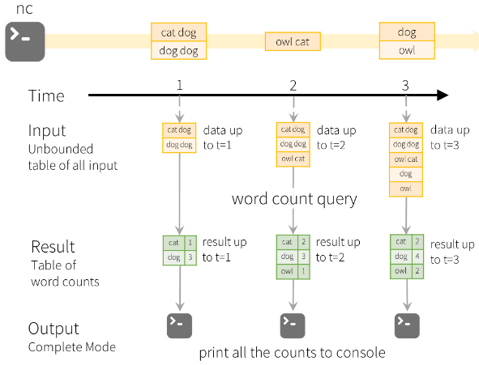
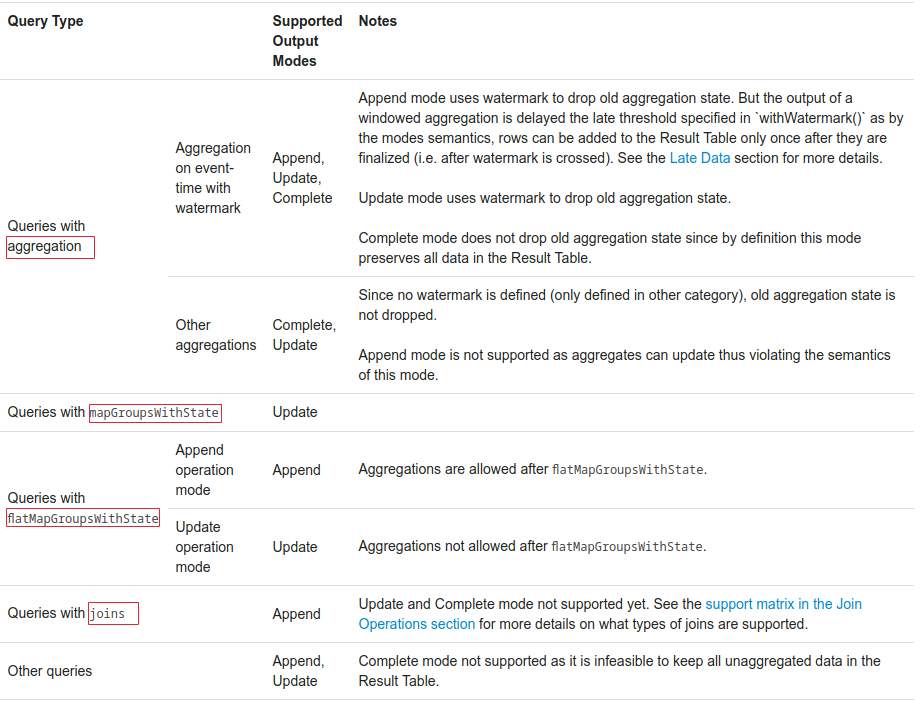

# Structured Streaming入门概览

官方给出的介绍如下：
- Structured Streaming（结构化流处理）基于Spark SQL引擎的、可扩展的、容错性的流处理引擎
- 可以像使用静态数据批处理（离线数据批处理）一样用在流数据计算上
- Spark SQL引擎会随着流数据的到达不断计算、更新结果
- 可以使用DataFrame/DataSet API，基于scala、java、python、r语言，用来计算流的聚合、时间事件窗口、流到批连接等
- 计算在Spark SQL引擎上也是同样优化的
- 系统通过检查点和预写日志确保端到端的一次性故障容错保证

> Structured Streaming is a scalable and fault-tolerant stream processing engine built on the Spark SQL engine. You can express your streaming computation the same way you would express a batch computation on static data. The Spark SQL engine will take care of running it incrementally and continuously and updating the final result as streaming data continues to arrive. You can use the Dataset/DataFrame API in Scala, Java, Python or R to express streaming aggregations, event-time windows, stream-to-batch joins, etc. The computation is executed on the same optimized Spark SQL engine. Finally, the system ensures end-to-end exactly-once fault-tolerance guarantees through checkpointing and Write-Ahead Logs. In short, Structured Streaming provides fast, scalable, fault-tolerant, end-to-end exactly-once stream processing without the user having to reason about streaming.

## 还是从WordCount说起
SparkStreaming入门案例也是词频统计，这里也是，先看下代码，再说下模型

```scala
import org.apache.spark.sql.SparkSession
import org.apache.spark.sql.functions._

val spark = SparkSession.builder.appName("WordCount).master("local[*]").getOrCreate()
import spark.implicits._  //隐式转换

// 创建一个持续从localhost:9999端口接收数据的 流式DataFrame，一个包含流数据的无限数据框，其有一个String类型的名为value的Column
val line = spark.readStream.format("socket")
  .option("host","localhost")
  .option("port",9999)
  .load()

val words = line.as[String].flatMap(_.split(" "))
val wordCount = words.groupBy("value").count
//开始数据接收和计算，并有结果更新就打印到控制台
//相关方法下文会谈及
val query = wordCount.writeStream.outputMode("complete").format("console").start
//等待计算结束
query.awaitTermination()
```
使用netcat命令向localhost:9999发送数据，没有nc命令的话，`sudo apt-get install netcat`安装下
> nc命令详细使用，[可参考这里](https://blog.csdn.net/zhangxiao93/article/details/52705642)

```
$ nc -lk 9999
hello world
hello spark
...
# 运行上面哪个程序
$ ./bin/run-example org.apache.spark.examples.sql.streaming.StructuredNetworkWordCount localhost 9999
# 打印
-------------------------------------------
Batch: 0
-------------------------------------------
+------+-----+
| value|count|
+------+-----+
|hello|    1|
| world|    1|
+------+-----+

-------------------------------------------
Batch: 1
-------------------------------------------
+------+-----+
| value|count|
+------+-----+
|hello|    2|
| world|    1|
|spark|    1|
+------+-----+
...
```

## 新的编程模型



如图所示，输入流数据会被视为输入表，一张未绑定的表，数据流中每一个到达的数据项（有一个触发间隔trigger interval的概念，比如1s）都会被视为一个追加到该输入表中的数据行(Row)。而基于该输入表的查询会产生一张结果表，每经过一个触发间隔就会更新结果表。结果表一旦更新，就会希望将新的结果保存到外部存储设备上。如下是官网给出的Programming Model


上面词频统计的编程模型，如图：


### [输出模式 outputMode](https://spark.apache.org/docs/2.4.0/structured-streaming-programming-guide.html#output-modes)
上面例子中有`outputMode("complete")`，完全模式。一共有**Append mode**（默认）、**Complete mode**、**Update mode**（从Spark 2.1.1开始使用）
- Append mode：只有自上次触发后添加到结果表的新行才会输出到外部存储设备。只适合哪些结果表中的Rows不会更改的查询，即该模式保证每行仅输出一次，像查询中仅使用`select，where，map，flatMap，filter，join`等
- Complete mode：每次触发都会将整个结果表输出的外部存储设备，聚合查询可使用
- Update mode：结果表中自上次触发后有更新的Rows才会输出到外部存储设备

具体适合哪种输出模式，官网给了个表格，如图：


## 事件时间和后期数据处理

## 容错语义

## 创建并使用(流式)DataSets和DataFrames
Spark 2.0后，静态的绑定数据，或者流式的未绑定数据都可以使用DataSets和DataFrames API，一样是使用SparkSession作为入口。而流DataFrame通过`DataStreamReader`接口创建，即`SparkSession.readStream()`的返回类型，像Spark SQL中创建DataFrame一样可以使用format（数据源格式）、schema（数据模式）、option（可选配置）等

### 内置输入源
- 文件源：以文件流的形式读取目录中写入的文件，支持text, csv, json, orc, parquet文件格式，文件必须以原子方式放在给的目录中
  - format，比如`format("csv")`
  - options参数
    - `maxFilesPerTrigger`，每次触发最大考虑的新文件数，默认无穷
    - `latestFirst`，是否首先处理最新的文件，当有大量积压的文件时很有用（默认 false）
    - `fileNameOnly`，是否只是基于文件名检测新文件，而非依据路径名，默认false
  - 支持通配符路径，但不支持逗号分隔的多个路径/通配符路径
  - 支持容错
  
  ```scala
  val mySchema = StructType(Array(
       StructField("name",StringType,true),
       StructField("age",IntegerType,true)
    ))
  val df = spark.readStream.format("csv").option("sep",",")
      .schema(mySchema).load("/path")
  ```
  
- Kafka源：读取Kafka中的数据，支持Kafka 0.10.0或更高版本，[参考：读取Kafka数据](https://spark.apache.org/docs/2.4.0/structured-streaming-kafka-integration.html)，支持容错
- 网络套接字源（仅供测试）：从套接字连接中读取utf-8文本数据，监听服务器套接字运行在Driver程序上，因为它**不提供端到端的容错**保证，所以只适合测试
  ```scala
  // 必须给定host、port
  // 像上面的wordcount
  val df = spark.readStream.format("socket").option("host","localhost").option("port",9999).load
  ```
- Rate source（仅供测试）：以每秒特定行数的Rows生成数据，每个输出行包含时间戳(timestamp)和值(value)。其中timestamp是包含消息调度时间(Timestamp类型)，value是包含消息计数(Long类型)，从0开始作为第一个Row
  - 支持容错
  - `rowsPerSecond`
  - `rampUpTime`
  - `numPartitions`

### 模式推断和流式DataFrame/DataSet的分区
从文件源创建的Structured Streaming默认是需要自己定义模式（Schema）的，这能确保即使出错也可以使用一致的模式进行流查询，但学过Spark SQL的就知道会有`inferSchema`这个配置参数，Structured Streaming中也是有的不过要手动设置`spark.sql.streaming.schemaInference`为true

流式DataFrame/DataSet的分区，指的是分区发现（不懂的话可以搜下Hive分区表的概念），形如`/key=value`的子目录存在的话，会递归这些子目录自动发现分区。而且当这些分区字段也存在Schema中时，Spark还会自动填充该字段。要想构成分区目录，必须在查询开始时就存在静态的分区目录，文档上举了个例子，当/data/year=2015/存在时，添加/data/year=2016/是可以的，但是更改分区列是无效的（如通过创建目录/data/date=2016-04-17/）

### 可使用的DataSets/DataFrame API
大多数API还是可以用在流式DataFrame/DataSet上的，除了一些，先列出这些不能使用的API：
- `limit/take(n)`
- distinct去重操作
- 有些outer join类型不支持，[详情见此](https://spark.apache.org/docs/2.4.0/structured-streaming-programming-guide.html#support-matrix-for-joins-in-streaming-queries)
  - `Stream +left outer/right outer join Static`不支持
  - `Static left outer/full outer join Stream` 不支持
  - `Stream full outer join Stream`不支持
- sort排序操作只有在**聚合操作后**且**outputMode为Complete**的情况下才行
- 不支持多个流聚合，即不能形成流聚合链
- `count()`，稍微想下也知道流式数据不能统计个数，但还是可以使用`ds.groupBy().count()`统计运行中的流式DataSets的计数
- `foreach()`，可替换成`ds.writeStream.foreach()`使用
- `show()`，可替换成`ds.writeStream.outputMode("complete").format("console")`在控制台打印

总的来看，就是因为流式数据不完全，而上面这些操作都是适合于哪些数据确定的操作

想了想，真没必要再次介绍，我之前翻译《Spark 权威指南》时，Chapter 5就是介绍DataSets/DataFrames API的使用，[点击跳转](https://juejin.im/post/5ce7e98a6fb9a07ea712ebd2)

不过要列出一个方法，`df.isStreaming`，返回布尔值来判断是否是流数据