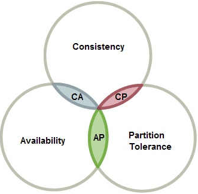
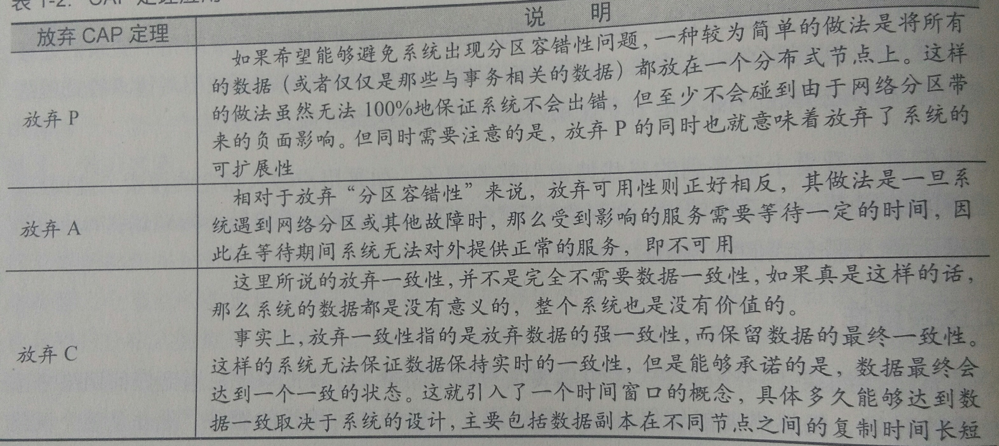
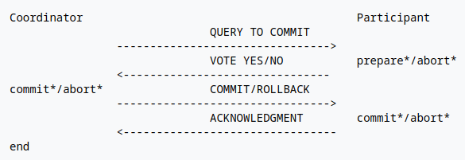
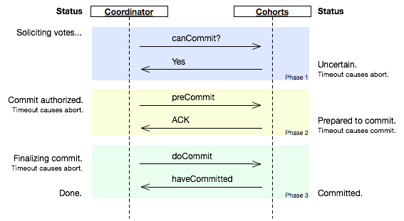
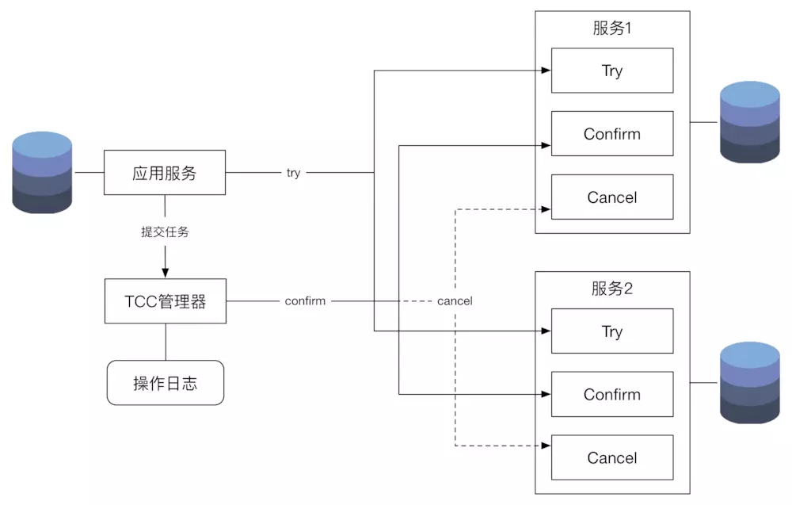

> 《从Paxos到ZooKeeper 分布式一致性原理与实践》笔记

首先是分布式，然后是数据一致性

### 分布式几大特点： 《分布式系统概念与设计》

- 分布性
- 并发性：并发操作共享资源
- 对等性：集群中没有主/从节点之分，所有节点都是对等的；副本概念
- 缺乏全局时钟：分布式系统中因为没有全局时钟序列控制，所以事务的先后顺序无法确定
- 故障总会发生

数据一致性是指对数据更新的同时也可以确保更新其他的副本，问题是更新其他副本会产生复制延迟，导致可能出现其他要读取该数据的操作获取到不一致数据

保证数据一致性和系统的运行性能都是有必要的

### 一致性级别

- 强一致性

这个是通过阻塞写操做，直到数据复制完成后才完成写操做，对用户而言就是向系统写入什么读出来的就是什么，但**对系统运行性能影响大**

- 弱一致性
  - 会话一致性
  - 用户一致性

这个约束了系统写入成功后，不承诺立刻可以读出写入的值，而是承若在多少时间内（秒级别）数据可以一致

细分开的会话一致性保证对于写入的值在同一个客户端会话中可以读到一致的值，其他会话不保证。用户一致性保证对于写入的值在同一个用户中可以读到一致的值，其他用户不保证

- 最终一致性

这个是弱一致性的特例，保证在一定时间内能确保数据一致，现在大多采用这种级别

### 经典CAP/BASE理论

用以处理分布式事务和数据一致性的经典理论

#### CAP理论（帽子理论）

一致性（C）、可用性（A）、分区容错性（P）最多只能保证同时满足两项，其中应用中要包含一致性（不然怎么叫数据一致性）

这里一致性是指强一致性，定义见上面

**可用性：**分布式系统可以在**有限时间**内对用户的请求**返回处理结果**。有限时间是系统设计之初就设定好的，返回结果是指正常的响应结果（成功或失败，分布式存在的一个问题是**三态**：成功、失败、超时）

**分区容错性：**分布式系统在遇到网络分区故障时，仍旧对外提供满足一致性和可用性的服务，除非整个网络环境发生故障

> 网络分区也是分布式存在的一个问题，具体来说就是”脑裂“。局部网络异常导致部分分布式节点间网络延时增大，最终认为对方down掉了，进而分成局部的小集群。

- 一致性和可用性不可同时成立

- 分区容错性对于分布式系统是基本的要求，如果不考虑P，就是把所有的数据都放在同一个分布式节点上，这样肯定不会网络分区出错，但是这样就算不上分布式，毫无扩展性

- CAP定理的应用 
  
  >

参考：阮一峰的[CAP 定理的含义](<http://www.ruanyifeng.com/blog/2018/07/cap.html>)

#### BASE理论（碱）

BASE理论三要素：基本可用（basically available）、软状态（soft state）、最终一致性（eventually consistent）。适用于大型高可用可扩展的分布式系统，通过牺牲强一致性来获取可用性，且允许数据在一定时间内不一致但最终一致

> 对应一种酸理论（ACID），数据库中处理分布式的ACID理论

上面谈及CAP要保证在C和A中权衡一番选择哪个，BASE就是对C、A的一种权衡，核心思想是无法保证强一致性，但可以选择适当方式使系统达到最终一致性（一种弱一致性的特例，见上文）。

**基本可用：**分布式系统出现故障时运行让出**部分**可用性，不是完全舍弃可用性。书上列出两个基本可用，响应时间上的损失、功能上的损失

**软状态：**允许系统中数据存在中间状态，并且中间状态的存在不影响系统的整体可用性（系统在不同节点之间数据副本的同步允许存在延迟）

**最终一致性：**保证系统能够使得数据最终一致，无需实时一致。数据达到一致的时间延迟取决于网络延迟、系统负载、数据复制方案设计等

### 分布式一致性协议

从之前学过的zookeeper看过来，集群中有一个Leader和多个Follower，分布式事务操作跨越多个节点时为了**保证事务处理的ACID特性**需要引入一个Coordinator（协调者）和多个参与者（Participant/Cohorts），协调者负责调度参与者的行为并决定参与者是否要把事务真正进行提交。wikipedia上讲了很多相关内容，下面放了连接

#### [2PC 二阶段提交](https://en.wikipedia.org/wiki/Two-phase_commit_protocol)

2PC大多用于关系型数据库，核心部分是对每个事务先尝试提交，依据反馈再同一决定事务的提交或回滚，属于强一致性算法

> ### Commit request (or voting) phase
>
> 1. The coordinator sends a **query to commit** message to all participants and waits until it has received a reply from all participants.
> 2. The participants execute the transaction up to the point where they will be asked to commit. They each write an entry to their *undo log* and an entry to their *redo log*.
> 3. Each participant replies with an **agreement** message (participant votes **Yes** to commit), if the participant's actions succeeded, or an **abort** message (participant votes **No**, not to commit), if the participant experiences a failure that will make it impossible to commit.
>
> ### Commit (or completion) phase
>
> #### Success
>
> If the coordinator received an **agreement** message from *all* participants during the commit-request phase:
>
> 1. The coordinator sends a **commit** message to all the participants.
> 2. Each participant completes the operation, and releases all the locks and resources held during the transaction.
> 3. Each participant sends an **acknowledgment** to the coordinator.
> 4. The coordinator completes the transaction when all acknowledgments have been received.
>
> #### Failure
>
> If *any* participant votes **No** during the commit-request phase (or the coordinator's timeout **expires**):
>
> 1. The coordinator sends a **rollback** message to all the participants.
> 2. Each participant undoes the transaction using the undo log, and releases the resources and locks held during the transaction.
> 3. Each participant sends an **acknowledgement** to the coordinator.
> 4. The coordinator undoes the transaction when all acknowledgements have been received.

##### 阶段一：投票阶段

1. 事务询问，协调者向所有参与者发送事务内容询问是否可以执行事务提交操作，并等待所有参与者响应
2. 执行事务，所有参与者执行事务，并把undo。redo日志写入事务日志（便于后续事务执行失败回滚）
3. 参与者响应协调者的事务询问，这里的响应就是投票，反馈yes/no表示事务执行成功/失败

##### 阶段二：提交执行阶段

依据所有参与者的反馈决定后续事务是否提交

- 成功，所有参与者都反馈yes，执行事务提交操作
  - 协调者向所有参与者发送Commit提交请求
  - 参与者接收请求后提交事务，完成后释放事务占有的资源、锁等
  - 事务提交后参与者向协调者发送ACK消息反馈
  - 协调者接收所有参与者的ACK后完成事务

- 失败，只要有参与者返回no（或者等待超时也没有接到所有参与者的yes反馈），执行事务中断
  - 协调者向所有参与者发送Rollback回滚请求
  - 参与者接收请求后根据undo日志来回滚事务，完成后释放事务占有的资源、锁等
  - 事务回滚后参与者向协调者发送ACK消息反馈
  - 协调者接收所有参与者的ACK后完成事务中断

##### 优缺点

优点就是原理和实现都简单

最大的确定是属于一种阻塞协议，限制了分布式系统的性能（参与者在等待其他参与者的响应时无法执行其他操作）。其次是单点问题，协调者关机的话参与者无法继续完成事务或者2PC无法运转。容错机制单调，只要有一台参与者失败整个事务都失败

#### [3PC 三阶段提交](https://en.wikipedia.org/wiki/Three-phase_commit_protocol)

三阶段是解决二阶段提交协议的不足而提出的，是非阻塞的

> ### Coordinator
>
> 1. The coordinator receives a transaction request. If there is a failure at this point, the coordinator aborts the transaction (i.e. upon recovery, it will consider the transaction aborted). Otherwise, the coordinator sends a canCommit? message to the cohorts and moves to the waiting state.
> 2. If there is a failure, timeout, or if the coordinator receives a No message in the waiting state, the coordinator aborts the transaction and sends an abort message to all cohorts. Otherwise the coordinator will receive Yes messages from all cohorts within the time window, so it sends preCommit messages to all cohorts and moves to the prepared state.
> 3. If the coordinator succeeds in the prepared state, it will move to the commit state. However if the coordinator times out while waiting for an acknowledgement from a cohort, it will abort the transaction. In the case where an acknowledgement is received from the majority of cohorts, the coordinator moves to the commit state as well.
>
> ### Cohort
>
> 1. The cohort receives a canCommit? message from the coordinator. If the cohort agrees it sends a Yes message to the coordinator and moves to the prepared state. Otherwise it sends a No message and aborts. If there is a failure, it moves to the abort state.
> 2. In the prepared state, if the cohort receives an abort message from the coordinator, fails, or times out waiting for a commit, it aborts. If the cohort receives a preCommit message, it sends an **ACK** message back and awaits a final commit or abort.
> 3. If, after a cohort member receives a preCommit message, the coordinator fails or times out, the cohort member goes forward with the commit.

#### TCC 简化版的三阶段提交

如图，分成Try、Canform、Cancel，任务的流程会先执行Try，如果执行没有问题，再执行Confirm，如果执行过程中出了问题，则执行操作的逆操Cancel

### 分布式一致性算法

#### Paxos 算法

#### ZAB 算法（zookeeper采用）

#### Raft 算法

#### 一致性哈希算法

### 阅读

- [保证分布式系统数据一致性的6种方案](<https://gameinstitute.qq.com/community/detail/110132>)
- 