### 概览

> ZooKeeper is a high-performance coordination service for distributed applications. It exposes common services - such as naming, configuration management, synchronization, and group services - in a simple interface so you don't have to write them from scratch. You can use it off-the-shelf to implement consensus, group management, leader election, and presence protocols.
>
> 参考：<http://zookeeper.apache.org/doc/current/index.html>

像文档中说的zookeeper是为**面向分布式**的应用**提供高性能的协调服务**，它提供命名、配置管理、同步和组服务，你可以用它来实现共识、组管理、Leader选举和存在协议、监听器、分布式锁等 


### 工作机制


基于观察者模式设计的分布式服务管理框架，负责存储和管理数据，接受观察者的注册。数据就是其他分布式应用的配置文件、节点状态等信息，观察者如图需要获取分布式服务的客户端。所以 zk=数据+通知机制，如果数据的状态发生变化，zk就通知在zk上注册的观察者，观察者也相应做出反应

### 特点

- zk集群由**一个Leader**，多个Follower组成（可以有Observer节点）
- zk集群正常服务的前提是**半数以上的节点存活**，所以zk适合奇数台服务器
- Leader负责进行投票的发起和决议，更新系统状态
- Follower用于接收Client请求并返回结果给Client，其次是在Leader选举中投票
- 数据保证全局一致，不像hadoop会有副本的概念，zk会在每个server上复制一份相同的数据副本，也保证client连接哪台server都是一样的（单系统映像）
- 数据实时性和原子性，实时性是数据量小同步时间短，原子性是数据更新要么成功要么失败，没有部分结果
- 顺序一致性，同一个 client 的更新请求按其发送顺序依次执行

### zk的数据模型和分层命名空间


如图，类似linux文件系统的树形结构，zk提供一个叫做Hierarchical Namespace（层次化命名空间），名称是由`/`分隔开的路径，命名空间的每一个节点都由唯一路径标识。然后每一个节点叫做znode（通过路径来唯一标识），ZooKeeper 被设计用于存储协调数据: 状态信息、配置、位置信息等所以每个节点数据通常很小（默认存储1MB数据）。znode维护一个包含数据更改、 ACL 更改和时间戳的版本号的属性结构，以支持缓存验证和协调更新。 每次 znode 的数据更改时，版本号都会增加。

> null字符串(\u0000)不作为路径名称，也不允许使用\ud800 – uF8FF, \uFFF0 – uFFFF
>
> 没有相对路径`.`和`..`，但`.`和`..`可以作为名称使用


如图，这是官网上介绍zk核心组件的图片，该树形结构的数据就是被存储在内存中的Replicated Database中，数据的更新将记录到磁盘以便恢复，并且写入内存数据库之前会先序列化到磁盘。其次，由于存储在内存中所以并非像hdfs一样用来存储数据，而是存放一些你关心的数据来作协调管理，简单说就是你干什么就存什么数据（这就引出集群管理、统一命名、分布式锁、配置管理等，见下文）。然后，就是每个znode存储的数据不该很大，默认1M
> 另外两个组件：请求处理器（Request Processor）和原子广播（Atomic Broadcast），除了请求处理器外，构成ZooKeeper服务的每个服务器都有一个备份。请求处理器是处理读写、改变状态等请求的，原子广播是分布式一致性的协议ZAB（ZooKeeper Atomic Broadcast）的实现

znode又分为永久节点（persistent）和临时节点（ephemeral），其内还有顺序之分。默认是永久的

- 持久化目录节点，client和zk断开连接后该znode任然存在
- 持久化顺序编号目录节点，同上但zk会给节点的名称进行顺序编号
  - 编号即在路径后加一个自增的计数器，计数器是%010d的格式——是一个十位数，比如：path0000000001
- 临时目录节点，client和zk断开连接后会删除znode，**临时节点不能包含子znode**
- 临时顺序目录节点，同上删除znode和节点顺序编号

顺序编号既是在节点名称后加上一个顺序号，顺序号是单调递增的并由父节点维护，可以确保事务操作的先后顺序（可以用作为所有的事件进行全局排序，客户端可以通过顺序号来推断事件顺序）

临时节点的作用可以动态地知道client上下线
> 创建临时节点（ephemeral）的Client一旦和Server失联，该临时节点就会被删除。具体来说，zk的Client和Server是通过TCP的长连接方式通信的，和其他分布式组件一样都使用了心跳机制来保持连接，该连接状态又叫做session（默认是2个心跳时间，及4s）。如果znode是临时的session也失效了就会被删除

关于临时节点znode，如果是因为Client挂机了（Server和Client间心跳超过session，所以session过期认为Client挂了）和该Client相关的临时znode会丢失。如果是和Client相连的Server挂机了，Client会自动故障切换到其他Server上，Session和相关临时znode任然有效（有备份）

下面在使用命令查看znode时会显示一大堆数据，这是znode的stat数据结构，包含数据更新的版本号，acl变更，时间戳。【在渐入佳境Zookeeper中细谈及了这点】

### zk下载和安装

我这里为了和之前hadoop集群配对选择了[cdh5.12.1版本](http://archive.cloudera.com/cdh5/cdh/5/)（zookeeper-3.4.5-cdh5.12.1.tar.gz）

#### 单机模式

```
1、zookeeper 的下载和安装
	tar -zxvf zookeeper-3.4.5-cdh5.12.1.tar.gz -C /home/hadoop 【指定解压位置】

2、进入到文件解压缩的路径
	cd /home/hadoop/zookeeper-3.4.5-cdh5.12.1/
3、vi ~/.bash_profile   (配置系统变量)
	export ZK_HOME=/home/hadoop/zookeeper-3.4.5-cdh5.12.1  (路径为zookeeper解压的路径)
	export PATH=$ZK_HOME/bin:$ZK_HOME/sbin:$PATH
	
4、source ~/.bash_profile 使配置生效，然后敲个zk再tab键补全有显示就是成功了

5、进入conf  配置zoo_sample.cfg   拷贝一份zoo_sample.cfg
	cp zoo_sample.cfg zoo.cfg   

6、vim zoo.cfg
	dataDir=/home/hadoop/zookeeper-3.4.5-cdh5.12.1/zkData(提前新建个目录zkData来存放数据)
	
7、然后zkServer.sh start(启动zookeeper)

8、查看进程 jps

9、zkCli.sh(进入zookeeper客户端查看)
```

如图，zkServer启动了一个QuorumPeerMain进程

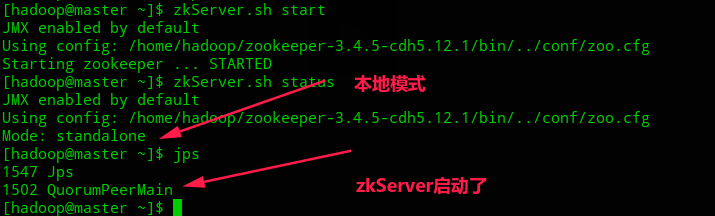

Client也启动

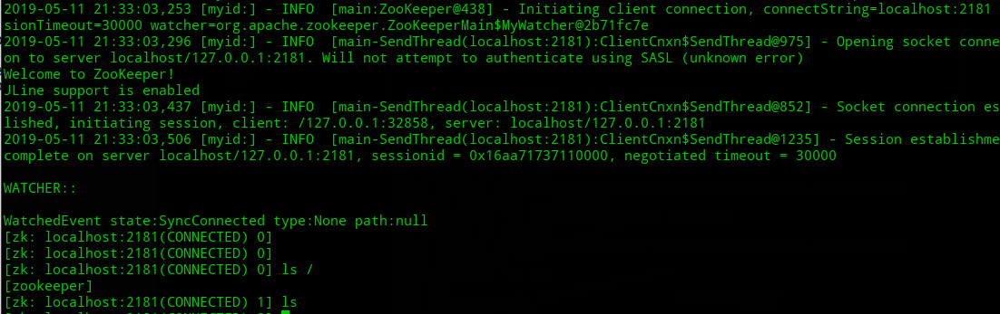

再次用jps查看，多了一个ZooKeeperMain进程

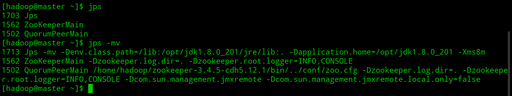


这里还有一个问题是zk的日志输出，看zkEnv.sh中显示`ZK_LOG_DIR="."，即`在哪里启动服务日志就输出在哪。我参照网上的教程修改了这里，但是任然没有改变输出路径 【**？？？？暂存待解决**】


#### 集群模式

上面的zookeeper还要分发到其他机器上，然后在`zkData/`目录下创建一个myid文件（服务器编号文件），其中是机器在集群中对应的Server ID号（随便取）

并在zoo.cfg上添加

```
server.1=ip1:2888:3888
server.2=ip2:2888:3888
server.3=ip3:2888:3888
```

`server.1`后面这个1是Server ID用来标识该机器在集群中的编号，也对应myid文件中的数，可以随便配，这里也是上面提到的顺序编号。ip1也是server.1的IP地址，其余同理。而2888和3888都是端口号，其中2888是Leader和Follower之间数据副本传输的端口，3888是L挂掉后，L和F之间用来选举投票的端口

配置好后，依次在三台节点上启动服务

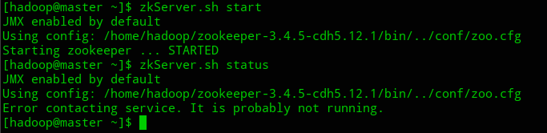

查看节点状态是未运行服务，但QuorumPeerMain进程是启动了。再启动第二台节点是的服务，查看状态显示follower

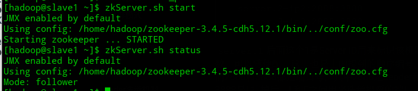

回去看刚刚那台节点状态，服务运行且节点成为leader

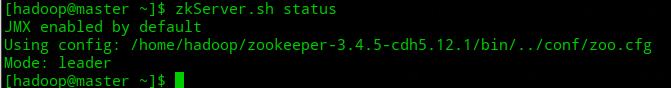


原因就是上面说的zk的特点之一：半数以上节点存活才运行服务，这里3台节点，第一台启动时不满足，启动第二台时满足。而且涉及leader选举，第二台投自己一票票数没有过半，就投第一台节点恰好第一台投了自己一票共2票过半成为leader（有时根据启动的情况不一定是这样的，因为如果自己票数不够就默认是投票给id最大的且启动了的机器）

再次启动第三台的服务，并关闭第一台节点的服务，查看第三台状态成为leader

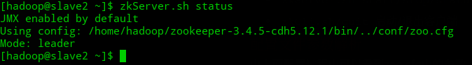

具体leader如何选举后续会聊及

#### 伪集群模式

就是为分布式，和集群模式的差别在于zoo.cfg中讲不同进程绑定在不同端口上，如下：

```
server.1=ip1:2888:3888
server.2=ip1:2889:3889
server.3=ip1:2890:3890
```


#### 命令

- `zkServer.sh start/stop/status` 启动/退出服务端/查看服务端状态

- `zkCli.sh/quit` 启动/退出客户端，默认连接本地zk Server，除非通过参数`-server ip:port`指明

- 客户端命令行操作

  - `help`查看帮助
  - 查看znode包含的内容 `ls path`，详细信息是`ls2 path`。默认是有一个zookeeper节点的，内容为空

  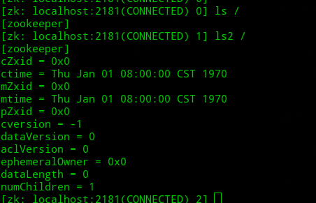

  - 获取节点的值，`get path [watch]`，watch是监听，但只能监听一次

  - 设置节点的值，`set path data`

  - 创建节点，`create [-e][-s] path data`，-s是含有序列号，-e是临时节点

    - 不支持递归创建节点，即无父节点就创建子节点

    - 临时节点创建后挂掉client再次启动可以发现临时节点已被删除

      - 临时节点不能再创建子znode，`Ephemerals cannot have children:`

    - 序列号也就是上面说的顺序编号，如下之前在/China下已经创建了JiangXi、LiaoNing所以GuangZhou的编号是从00000003开始，要是没有节点的话自然是从00000000开始(怪，不是1，搞不清)
  
      > 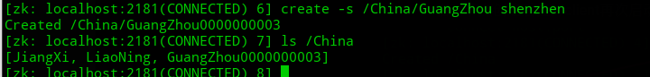

  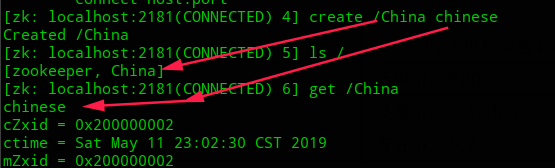

  - 删除节点值，`delete path`如`delete /China/JiangXi`，**前提保证znode不包含子znode**，如果有的话使用`rmr path`递归删除

  - 监听znode值的变化，`get path watch`，然后再另一台机器上修改path对应的值会发现如图 【**但也只是监听一次**】

    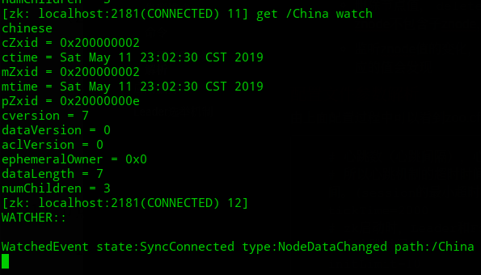

  - 同样可以`ls path watch`监听子节点变化
  
  - 查看节点状态，`stat path`


#### 配置文件参数解析

由上面配置过程中可以看到zoo.cfg中的参数

```
# 心跳数（心跳间隔），心跳是client和server通信机制，默认2s
# 所以心跳机制的超时时间应该设置最小的session超时时间为两倍心跳时间。(session的最小超时时间是2*tickTime)
tickTime=2000
# zk启动时，Leader和Follower最长同步通信时间（通信时限），如下默认10个心跳时间（10*2s），投票选举新leader的初始化时间
initLimit=10
# zk启动后，Leader和Follower最长同步通信时间（通信时限），如下默认5个心跳时间（5*2s），检测Follower是否死亡
# F死亡的话会从服务器列表中删除该F
syncLimit=5
# 内存数据库快照信息存储的位置，默认更新的事务日志也保存到数据库
dataDir=/tmp/zookeeper
# client连接zk server的端口号
clientPort=2181
```


### 应用服务
因为znode的状态是被zookeeper监控的，所以一旦znode的value或者是子znode发生变化，就可以告诉监控该znode的Client

- 统一命名服务

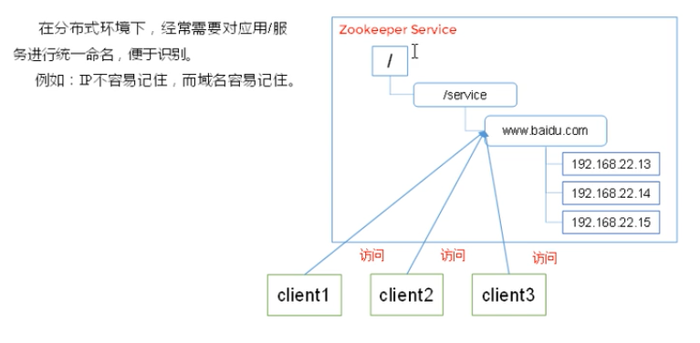

- 统一配置管理
  - 像Kafka集群的所有节点的配置信息是一致的，且配置文件的修改可以快速同步到各个节点上，所以使用内置的zk实现。还有是Kafka 0.9版本之前的offset也是交由zk管理的，就是管理消息队列的消费
  - 如图，将配置信息写入一个znode，客户端服务器都监听这个znode，一旦配置作了修改zk将通知各个客户端
> 1. 实现Watcher回调方法process()
> 2. Client上对该节点监控`zk.exist("/Configuration″,true)`
> 3. 一旦/Configuration的数据发生变化，Watcher就会通知Client并执行process方法，然后拉取最新数据`zk.getData("/Configuration″,false,null)`
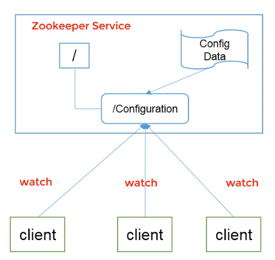
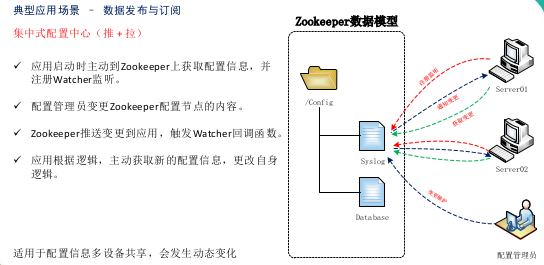

- 集群管理
  - 像每台机器的运行状态收集，分布式任务的状态汇报，对集群中设备上下线操作等。在Kafka中broker就是由zk管理的，Kafka在进行资源调度时需要知道哪些broker存活，所以可以把broker注册为zk的临时节点，比如说brokers/id/0，只要监控/brokers/id节点的变化就能动态感知broker的状态
  - 如图，可以把节点信息写入一个znode（注册）并监听，可以获取节点的实时状态变化

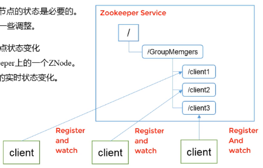

- 服务器节点动态上下线
  - 我感觉这个应该包含在集群管理内部，它所做的也是将服务器状态信息注册到znode上，客户端监听这个znode知道哪些服务器是在线的，哪些下线（死亡），哪些服务器又上线了，就可以选择向哪些服务器发起请求
- 分布式消息同步和协调机制
  - 可以减少系统耦合程度
> ZooKeeper中特有watcher注册与异步通知机制，能够很好的实现分布式环境下不同系统之间的通知与协调，实现对数据变更的实时处理。使用方法通常是不同系统都对ZK上同一个znode进行注册，监听znode的变化（包括znode本身内容及子节点的），其中一个系统update了znode，那么另一个系统能够收到通知，并作出相应处理。

- 软负载均衡

zk记录每台服务器的访问次数，当client请求服务时选择访问数最少的服务器去处理请求。我感觉是包含在同一命名服务之中的

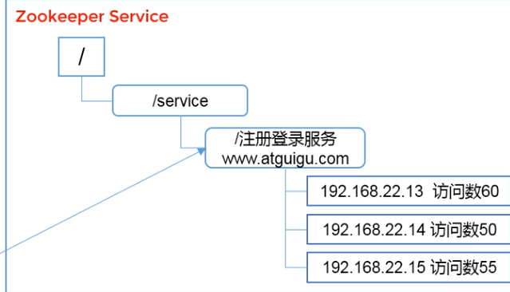

- Master选举，解决脑裂问题，像Hadoop HA机制。我感觉这种也是属于集群管理一部分

- 分布式锁（锁又分独占式和控制时序式锁）
  - 利用zookeeper集群上相同名字的znode一定是同一个znode实现的，把znode看作一把锁
  - 独占式锁：所有尝试获取锁的Client都去创建	/distribute_lock 节点，最终成功创建的那个客户端也即拥有了这把锁
  - 控制时序：所有尝试获取锁的Client都会得到锁，不过就是时序先后的问题。预先创建/distribute_lock节点，Client在它下面创建临时有序节点。zk的/distribute_lock节点维持一份sequence,保证子节点创建的时序性，从而也形成了每个客户端的全局时序

> zk本身对数据读写并不提供加锁互斥的服务，但是提供基于版本比对的更新操作，客户端可以基于此自己实现加锁逻辑


> **强烈推荐**看一看博客园上的一个大佬写的相关应用服务:<https://www.cnblogs.com/sunddenly/p/4092654.html>，如下内容也引自该文
> ##### zookeeper的实际应用
> 假设我们的集群有：
>
> (1) **20个搜索引擎的服务器**：每个负责总索引中的一部分的搜索任务。
>
> ​	**①** 搜索引擎的服务器中的15个服务器现在提供搜索服务。
>
> ​	**②** 5个服务器正在生成索引。
>
> 这20个搜索引擎的服务器，经常要让正在提供搜索服务的服务器停止提供服务开始生成索引,或生成索引的服务器已经把索引生成完成可以搜索提供服务了。
>
> (2) **一个总服务器**：负责向这20个搜索引擎的服务器发出搜索请求并合并结果集。
>
> (3) **一个备用的总服务器**：负责当总服务器宕机时替换总服务器。
>
> (4) **一个web的cgi**：向总服务器发出搜索请求。
>
> 使用Zookeeper可以保证：
>
> (1) **总服务器**：自动感知有多少提供搜索引擎的服务器，并向这些服务器发出搜索请求。
>
> (2) **备用的总服务器**：宕机时自动启用备用的总服务器。
>
> (3) **web的cgi**：能够自动地获知总服务器的网络地址变化。
>
> (4) 实现如下：
>
> ​	**①** **提供搜索**引擎的服务器都在Zookeeper中创建znode，`zk.create("/search/nodes/node1", "hostname".getBytes(), Ids.OPEN_ACL_UNSAFE, CreateFlags.EPHEMERAL);`
>
> ​	**② 总服务器**可以从Zookeeper中获取一个znode的子节点的列表，`zk.getChildren("/search/nodes", true);`
>
> ​	**③** **总服务器**遍历这些子节点，并获取子节点的数据生成提供搜索引擎的服务器列表；
>
> ​	**④** **当总服务器**接收到子节点改变的事件信息,重新返回第二步；
>
> ​	**⑤** **总服务器**在Zookeeper中创建节点，`zk.create("/search/master", "hostname".getBytes(), Ids.OPEN_ACL_UNSAFE, CreateFlags.EPHEMERAL);`
>
> ​	**⑥ 备用的总服务器**监控Zookeeper中的"/search/master"节点。当这个znode的节点数据改变时，把自己启动变成总服务器，并把自己的网络地址数据放进这个节点。
>
> ​	**⑦** **web的cgi**从Zookeeper中"/search/master"节点获取总服务器的网络地址数据，并向其发送搜索请求。
>
> ​	**⑧** **web的cgi**监控Zookeeper中的"/search/master"节点，当这个znode的节点数据改变时，从这个节点获取总服务器的网络地址数据,并改变当前的总服务器的网络地址。

### Leader选举机制

- 由Paxos协议，必须保证半数以上节点活动才可以起服务
- 没有指定Master/Slave，但会内部选举出一个leader其余是follower
- 选举触发时机，一是集群启动时，二是运行中leader挂机时
- 如图最新启动，且依顺序启动server12345

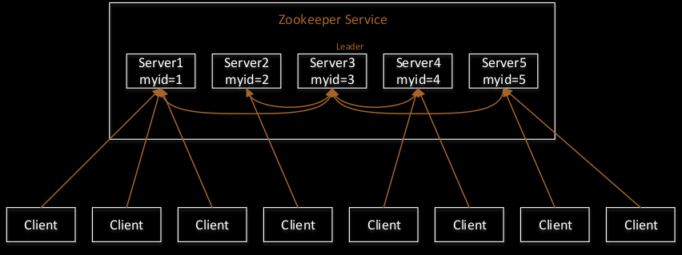

- 选举流程
  - 启动server1/2时节点数未过半，选举状态为looking，且服务未运行
  - 启动3时，节点数过半满足了，然后是投票过程。server1先投自己一票，但是票数未过半，结合其他节点交换信息，投id较大的节点一票。假设有启动顺序会投server2，假设server2自己的一票还是未到标。然后server3启动，同样是这么个投票流程，它有3票满足票数过半，立刻成为leader。哪怕server4启动了也不影响server3
  - zk集群运行过程中leader挂机了，也会这么相互通信投票选出新的leader（前提节点数过半）
>详细可参见：渐入佳境ZooKeeper