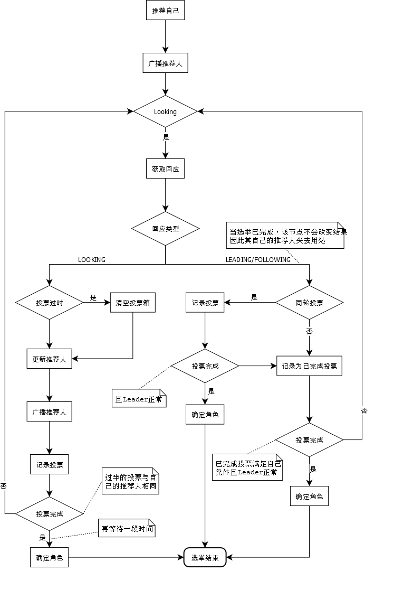
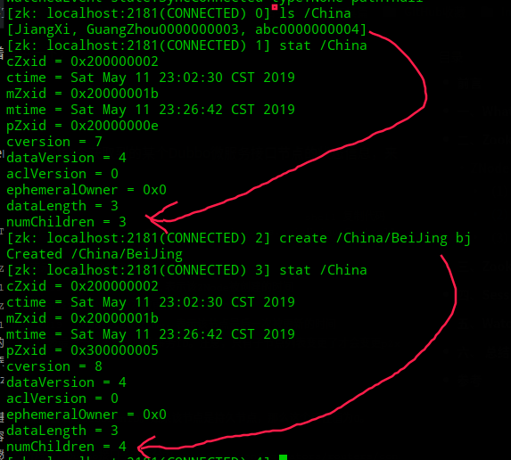
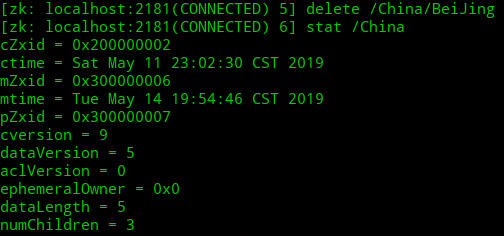
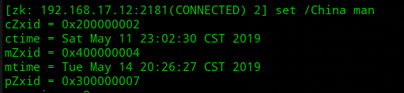
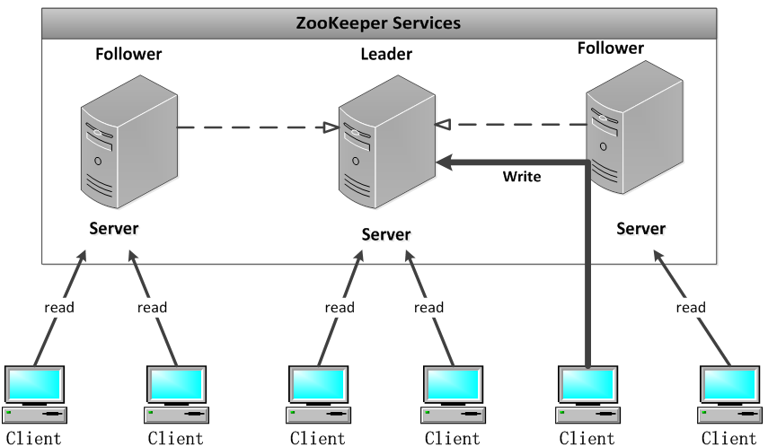

## 为什么ZK建议配置节点个数为奇数个？

由前面谈及的zk的特点之一——集群保证半数以上的机器正常工作才对外提供服务——可知，像2台机器的集群要是挂掉1台集群zk服务就不能用了，包含3台机器的集群容忍挂掉1台，同理4台的容忍挂掉1台，5容忍2，6容忍2。可见包含2×n和2×n-1台机器的集群容忍程度一样，n-1台，既然一样为啥要多浪费一台机器的资源

## ZK的Quorums机制

这其实就是半数以上机器正常工作才提供zk服务的实质，我感觉能否对外提供服务的根本就是能否选举出一个Leader，因为Majority Quorums机制也是用来支持Leader选举的

> 看到有个解释把Majority Quorums称为从众机制

[参考文档](http://zookeeper.apache.org/doc/r3.4.10/zookeeperInternals.html#sc_quorum)，zookeeper包含Majority Quorums机制还提供了下列机制

1. Majority Quorums （默认）

2. Weight

3. Hierarchy of groups

Quorums投票方式一来保证选出Leader，二来可以用来解决“脑裂”(split-brain)问题

zookeeper中Quorums作用：

- 使得集群中最少的节点数用来选举Leader保证集群可用
- 集群中最少的节点数已经更新了数据才会通知客户端该数据已经安全保存了，客户端可以继续执行其他任务，后续其他节点（稍后）也会同步这份数据以保证数据最终一致

> 脑裂是指集群中因为网络故障等问题被分成了两部分，两部分不知道对方是否正常就都选出了自己的Leader，但网络故障恢复后就出现了两个brain（Leader）导致集群的行为不一致，相互争抢共享资源导致系统混乱

zookeeper就是默认使用Quorums方式，只有集群中超过半数节点投票才能选举出Leader，来预防脑裂问题

除了Quorums外还有其余两种方法解决脑裂问题：

- Redundant communications（冗杂通信），集群采用多种通信方式，避免单一通信方式失败导致集群中节点无法通信认为节点down掉了
- Fencing（隔离），共享资源的方式，比如能看到共享资源就表示在集群中，能够获得共享资源的锁的就是Leader，看不到共享资源的，就不在集群中
  - 比如说Hadoop中用zk解决NameNode脑裂，就是把旧的NameNode隔离起来，使它不能正常对外提供服务，[参考：Hadoop NameNode 高可用 (High Availability) 实现解析](https://www.ibm.com/developerworks/cn/opensource/os-cn-hadoop-name-node/index.html)
- 仲裁，当两个节点出现分歧时，由第3方的仲裁者决定听谁的

参考：<http://suroot.cn/306.html>

## 细谈ZK的Leader选举

zookeeper中包含两种leader选举算法：**LeaderElection** 和 **FastLeaderElection**（AuthFastLeaderElection 是 FastLeaderElection 的一个变体，它使用 UDP 并允许服务器执行一种简单的身份验证以避免 IP 欺骗）

见：http://zookeeper.apache.org/doc/r3.4.10/zookeeperInternals.html#sc_leaderElection

而zk集群默认情况是使用FastLeader算法来选举Leader的

> 在zoo.cfg中通过electionAlg属性配置，使用数字0~3对应LeaderElection、AuthFastLeaderElection和FastLeaderElection
>
> **不用管了，zk3.4.0之后已经废弃前两种只保留了FastLeaderElection算法**

Leader选举发生的两个可能：初始化启动时，运行时Leader挂机

先看几个定义

- zxid: 事务 zxid 包含了本地数据的最后更新时间相关的信息。
- serverid: 当前的 Server ID, 通过配置文件myid指定
- 节点状态：LOOKING、LEADING、FOLLOWING、OBSERVING。节点启动时是LOOKING，选举为leader是LEADING，follower是FOLLOWING，不参与选举是OBSERVING
- epoch：选举的轮数

### 初始化启动时

- 率先推举自己作为leader，投票信息用（serverid，zxid）表示，然后将投票信息分发给其余服务器

- 接受来自其余服务器的投票，比较投票有效性（是否是本轮投票epoch，是否是来自LOOKING状态的服务器）

- 处理接收的投票

  > 本轮投票
  >
  > 1. 优先考虑zxid，zxid大的作为leader
  > 2. zxid相同，serverid大的作为leader

- 统计投票，每轮投票服务器统计所有投票，如果有投票已经被过半服务器接收到，则认为该投票对应的serverid是leader

- 改变服务器状态，leader变LEADING，follower变FOLLOWING

### Leader挂机时

- 改变服务器状态，将非OBSERVING的服务器都变为LOOKING
- 生产投票信息，并投票。投票过程同上，不过有一点是运行时每台服务器的zxid可能不一样
- 接收、处理、统计投票、改变服务器状态

> 图片出自：[图解zookeeper FastLeader选举算法](<http://codemacro.com/2014/10/19/zk-fastleaderelection/>)

### Leader算法分析

可参考源码解读文章：[zookeeper源代码分析三:启动与Leader选举]([http://jacksonzhou.top/index.php/2019/04/03/zookeeper%E6%BA%90%E4%BB%A3%E7%A0%81%E5%88%86%E6%9E%90%E4%B8%89%E5%90%AF%E5%8A%A8%E4%B8%8Eleader%E9%80%89%E4%B8%BE/](http://jacksonzhou.top/index.php/2019/04/03/zookeeper源代码分析三启动与leader选举/))

## ZK3.3新增的Observe观察者角色

为客户端提供读服务，将写请求则转发给Leader。不参与选举投票和“过半写成功”策略，只听取投票结果、同步leader状态。设计的目的是希望能**动态扩展zookeeper集群**又不会降低写性能，在不影响写性能的情况下**提升集群的读性能**

-  观察者配置
  - `zoo.cfg`中设置`peerType=observe`，服务器设置`server.4:IP4:2188:3188:observer`就是最后跟一个observer

ZooKeeper集群的读取负载很高，或者客户端多到跨机房，可以设置一些observer服务器，以提高读取的吞吐量。它不属于Quorums。其次是observer不需要将事务持久化到磁盘，一旦observer被重启，需要从leader重新同步整个名字空间

我看浪尖的[这篇文章](https://zhuanlan.zhihu.com/p/42067231)，说是**Observers可用于与另一个数据中心的ZooKeeper服务器通信**

可以参考下：[ZooKeeper的三种角色](https://blog.csdn.net/mayp1/article/details/52026797)

## ZNode中Stat的数据结构

如图：

- ctime：znode创建时间（单位毫秒，从1970.1.1.0:0:0:开始）
- mtime：znode最近修改时间（同上）
- Zxid：可以理解成一种事务id，zxid1<zxid2表示zxid1对应的事务先发生
  - cZxid：创建该znde的事务的id
  - mZxid：最后**修改该znode**的事务id
  - pZxid：该znode的**子znode**被修改（新增/删除）的事务id，只是子znode的value改变不会更改pZxid

- dataVersion：表示对该znode的数据所做更改的次数，如图我删除znode BeiJing后dataVersion加一
- cversion：表示对此znode的子节点进行的更改次数，如图我在/China下新增一个znode后cversion加一
- aclVersion：表示对此znode的ACL进行更改的次数。

- dataLength是znode所对应的value的长度
- numChildren是子znode的个数

下面这张图是我手动挂机掉leader后，重新连接其他server登录后修改的，发现mZxid变成了0x4000...

Zxid是一个64位数，高32位是epoch用来标识leader关系是否改变，每次一个leader被选出来，它都会有一个新的epoch，标识当前属于那个leader。低32位用于递增计数。

## Watcher监控机制
实际调用java API开发时会发现像`getChildren(String path, boolean watch)`、`getData(String path, boolean watch, Stat stat)`、`exists(String path, boolean watch)`都要求是否监控或者是直接传入Watcher监控

在之前初窥门径ZooKeeper中讲解命令行操作时也谈及了，这种监控机制是**一次性的**。zk保证Client在接收到Watch Event（监视事件）之后才接收到数据的更新信息。监视事件的触发顺序和事件的分发顺序一致，与ZooKeeper服务器上数据变化的顺序也一致
当Client指明要监控时，会在zk的Server上触发相应的“监视点”（监视点是保留在zk的Server上的），当客户端断线后重连，与它的相关的"监视点"都会自动重新注册。但也因为这样，监视点可能会被错过，客户端B设置了节点Aexists的"监视点"，但B断线了，在B断线过程中节点A被创建又被删除。此时，B再连线后不知道A节点曾经被创建过
Client接收到"监视"事件到设置新"监视点"是有延时的（因为监控是一次性的，但又要一直监控），所以可能出现监控不到所有数据的变化

## zookeeper的读写机制

> 这张图出处不明，网上到处都是，我看画的挺好的就拿来用了

- read操作
因为分布式一致性，所有Server最终都会有数据节点的拷贝，所以Client在读数据时只需要连接的Server响应即可
- write操作
写请求有所不同，同样是分布式一致性的缘故，zk采用的ZAB协议要求写请求交由Leader处理。所以Client先连接Server并发送写请求，该Server会将写请求转发给leader，leader处理该请求只要有半数以上节点写入成功就会响应Client写入成功，当然后续其他节点也会同步该数据

## ZAB（ZooKeeper Atomic Broadcast）协议
**一种分布式强一致性协议**，zk的核心组件，有**恢复模式和广播模式**两种模式，保证了Server间的一致。
至于分布式一致性原理可以参考我之前的笔记——[分布式一致性原理](https://github.com/josonle/BigData-Learning/blob/master/ZooKeeper/%E5%88%86%E5%B8%83%E5%BC%8F%E4%B8%80%E8%87%B4%E6%80%A7%E5%8E%9F%E7%90%86.md)，涉及CAP理论，2PC/3PC/Paxos/Zab/Raft协议。ZAB不是像Paxos这样同用的分布式一致性算法，而是专门为zookeeper设计的崩溃可恢复的原子消息广播算法

ZAB协议是一种主备模型的架构（主备，一个Leader多个Follower），保证同一时刻集群中只能由一个主进程（Leader上）来广播服务器的数据状态变更，变更以事务Proposal（提议）的形式广播到所有的副本进程（Follower上）上去
另外，数据状态变更在分布式环境实际应用中肯定会有依赖关系，所以ZAB协议还保证如果一个数据状态变更被处理，那么相应的所有需要依赖的状态变更都提前被处理了。还有是ZAB协议要考虑主进程挂机或者重启的异常问题

## 待续。。。